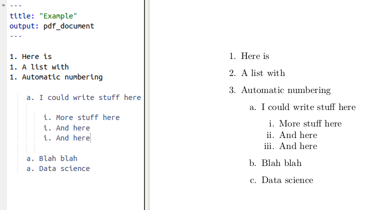
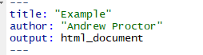

```{r setup, include=FALSE}
library(tidyverse)
library(fueleconomy)
library(rio)
library(magrittr)
library(rvest)
library(glue)
library(Ecdat)
library(rstan)
library(rstanarm)
library(bayesplot)
library(Stat2Data)
library(magrittr)
```

<br>

# **R Basics**

<br>

## **R & Statistical Programming** 

### Purpose of statistical programming software

Unlike spreadsheet applications (like Excel) or point-and-click statistical 
analysis software  (SPSS), statistical programming software is based around a 
script-file where the user writes a series of commands to be performed,

**Advantages of statistical programming software**

- Data analysis process is reproducible and transparent.

- Due to the open-ended nature of language-based programming, there is far more 
versatility and customizability in what you can do with data.

- *Typically* statistical programming software has a much more comprehensive 
range of built-in analysis functions than spreadsheets etc.

<br>

### Characteristics of R

* R is an open-source language specifically designed for statistical computing
(and it's the most popular choice among statisticians)

* Because of its popularity and open-source nature, the R community's 
package development means it has the most prewritten functionality of any data 
analysis software.

* Differs from software like Stata, however, in that while you can use 
prewritten functions, it is equally adept at programming solutions for yourself.

* Because it's usage is broader, R also has a steeper learning curve than Stata.

<br>

### Comparison to other statistical programming software

* **Stata**: The traditional choice of (academic) economists.  
    +  Stata is more specifically econometrics focused and is much more 
    command-oriented.  Easier to use for standard applications, but if there's 
    not a Stata command for what you want to do, it's harder to write something yourself.  
    +  Stata is also very different than R in that you can only ever work with one 
    dataset at a time, while in R, it's typical to have a number of data objects 
    in the environment.

* **SAS**:  Similar to Stata, but more commonly  used in business & the private 
sector, in part because it's typically more convenient for massive datasets.  Otherwise, 
I think it's seen as a bit older and less user-friendly.

* **Python**: Another option based more on programming from scratch and with 
less prewritten commands.  Python isn't specific to math \& statistics, but 
instead is a general programming language used across a range of fields.  
Probably the most similar software choice to R at this point, with better 
general use (and programming ease) at the cost of less package development 
specific to econometrics/data analysis.

* **Matlab**: Popular in macroeconomics and theory work, not so much in 
empirical work. Matlab is powerful, but is much more based on programming "from 
scratch" using matrices and mathematical expressions.

<br>

### Useful resources for learning R

- **DataCamp:**  interactive online lessons in R. 
    + Some of the courses are free (particularly community-written lessons like 
    the one you'll do today), but for paid courses, DataCamp costs about 300 SEK / mo.

- **RStudio Cheat Sheets:** Very helpful 1-2 page overviews of common tasks 
and packages in R.

- **Quick-R:**  Website with short example-driven overviews of R functionality.

- **StackOverflow:**  Part of the Stack Exchange network, StackOverflow is a 
Q&A community website for people who work in programming.  Tons of incredibly
good R users and developers interact on StackExchange, so it's a great place to
search for answers to your questions.


- **R-Bloggers:**  Blog aggregagator for posts about R.  Great place to learn 
really cool things you can do in R.

- **R for Data Science:**  Online version of the book by Hadley Wickham, who has
written many of the best packages for R, including the Tidyverse, which we will 
cover.

<br>
<br>

## **Getting Started in R**

<br>

### RStudio GUI

RStudio is an is an integrated development environment (IDE).  

This means that in addition to a script editor, it also let's you view your 
environments, data objects, plots, help files, etc directly within the application.


<br>

### Executing code from the script 

To execute a section of code, highlight the code and click "Run" or use 
Ctrl-Enter. 

- For a single line of code, you don't need to highlight, just click 
into that line.

- To execute the whole document, the hotkey is Ctrl-Shift-Enter.

<br>

### Style advise

Unlike Stata, with R you don't need any special code to write multiline code - 
it's already the default (functions are written with parentheses, so its clear
when the line actually ends.)

- So there's no excuse for really long lines.  Accepted style suggests using a 
80-character limit for your lines.

- RStudio has the option to show a guideline for margins.  **Use it!**
    + Go to **Tools -> Global Options -> Code -> Display**, then select
    **Show Margin** and enter 80 characters.
    
You can also write multiple expressions on the same line by using 
<span style="color:blue">;</span>  as a manual line break.

<br>

### Comments

To create a comment in R, use a hash (<span style="color:blue"> **#**</span>.  For example:

```{r comments}
# Here I add 2 + 2
2 + 2
```

<br>

### Help files in R

You can access the help file for any given function using the **help function.** 
You can call it a few different ways:

1.  In the console, use <span style="color:blue"> **help()**</span>
2.  In the console, use <span style="color:blue"> **?**</span> 
immediately followed by the name of the function (no space inbetween)
3.  In the Help pane, search for the function in question.

<span style="color:blue"> **?**</span> is shorter, so that's the most frequent method.  

```{r help, eval=FALSE}
# Help on the lm (linear regression) function
?lm
```

<br>

### Setting the working directory

To set the working directory, use the function  <span style="color:blue"> **setwd()**</span>. 
The argument for the function is simply the path to the working directory, in 
quotes.

However:  be sure that the slashes in the path are forward slashes
(/). For Windows, this is not the case if you copy the 
path from File Explorer so you'll need to change them. 

```{r wd, eval=FALSE}
# Set Working Directory
setwd("C:/Users/Andrew/Documents/MyProject")
```


<br>
<br>

## **Data Types & Operations**

### Math operations in R
Examples of basic mathematical operations in R:
```{r math1}
# Addition and Subtraction
2 + 2
# Multiplication and Division
2*2 + 2/2
# Exponentiation and Logarithms
2^2 + log(2)
```

<br>

### Logical operations in R

You can also evaluate logical expressions in R

```{r logical}
## Less than
5 <= 6
## Greater than or equal to
5 >= 6
## Equality
5 == 6
## Negatiion
5 != 6
```

You can also use AND (<span style="color:blue"> **&**</span>) and OR 
(<span style="color:blue"> **|**</span>) operation with logical expressions:
```{r logical2}
## Is 5 equal to 5 OR 5 is equal to 6
(5 == 5) | (5 == 6)
## 5 less 6 AND 6 < 5
(5 < 6) & (7 < 6)
```

<br>

### Defining an object

To define an object, use <span style="color:blue">**<-**</span>.  For example


```{r define}
# Assign 2 + 2 to the variable x
x <- 2 + 2
```

**Note:** In R, there is no distinction between defining and redefining an 
object (*a la* gen/replace in Stata). 
```{r define2}
y <- 4 # Define y
y <- y^2 # Redefine y
y #Print y 
```

<br>

### Data classes
Data elements in R are categorized into a few seperate classes (ie types)

- **numeric**:  Data that should be interpreted as a number.

- **logical:** Data that should be interpreted as a logical statment, ie. 
`r TRUE` or `r FALSE`.

-  **character**:  Strings/text.
    + Note, depending on how you format your data, elements that may look 
      like logical or numeric may instead be character.
- **factor**: In affect, a categorical variable.  Value may be text, but R 
interprets the variable as taking on one of limited number of possible values 
(e.g. sex, municipality, industry etc) 

<br>

### What's the object class?
```{r test}
a <- 2; class(a)
b <- "2"; class(b)
c <- TRUE; class(c)
d <- "True"; class(d)

```    

<br>
<br>

## **Vectors & Matrices**

<br>

### Vectors

The basic data structure containing multiple elements in R is the vector. 

- An R vector is much like the typical view of a vector in mathematics, ie it's 
basically a 1D array of elements.

- Typical vectors are of a single-type (these are called atomic vectors).

- A *list* vector can also have elements of different types.

<br>

### Creating vectors

To create a vector, use the function <span style="color:blue">**c()**</span>.  

```{r days}
# Create `days` vectors
days <- c("Mon","Tues","Wed",
           "Thurs", "Fri")

# Create `temps` vectors
temps <- c(13,18,17,20,21)
# Display `temps` vector
temps
```

<br>

### Naming vectors
You can name a vector by assigning a vector of names to <span style="color:blue">**c()**</span>, 
where the vector to be named goes in the parentheses. 
```{r namedays}
# Assign `days` as names for `temps` vector
names(temps) <- days 
# Display `temps` vector
temps
```

<br>

### Subsetting vectors
There are multiple ways of subsetting data in R.  One of the easiest methods for 
vectors is to put the subset condition in brackets:
```{r subsettemp}
# Subset temps greater than or equal to 10
temps[temps>=18]

```

<br>

### Operations on vectors
Operations on vectors are element-wise.  So if 2 vectors are added together, 
each element of the $2^{nd}$ vector would be added to the corresponding element 
from the $1^{st}$ vector.
```{r averagevector}
# Temp vector for week 2
temps2 <- c(8,10,10,15,16)
names(temps2) <- days
# Create average temperature by day
avg_temp <- (temps + temps2) / 2
# Display `avg_temp`
avg_temp

```

<br>

### Matrices
- Data in a 2-dimensional structure can be represented in two formats, as a 
*matrix* or as a *data frame.* 

- A matrix is used for 2D data structures of a single data type (like atomic 
vectors). 
    + Usually, matrices are composed of numeric objects.

- To create a matrix, use the <span style="color:blue">**matrix()**</span> command. 

The syntax of <span style="color:blue">** matrix() **</span> is:
```{r matrixsynatx, eval=FALSE}
matrix(x, nrow=a, ncol=b, byrow=FALSE/TRUE)
```
-*x* is the data that will populate the matrix.

-*nrow* and *ncol* specify the number of rows and columns, respectively.  
Generally need to specify just 1 since the number of elements and a single 
condition will determine the other.

-*byrow* specifies whether to fill in the elements by row or column. The
default is <span style="color:blue">**byrow=FALSE**</span>, ie the data is filled in by 
column.

<br>

### Creating a matrix from scratch

A simple example of creating a matrix would be:
```{r matrix1thru6a}
matrix(1:6, nrow=2, ncol=3, byrow=FALSE)
```
Note the difference in appearance if we instead **byrow=TRUE**
```{r matrix1thru6b}
matrix(1:6, nrow=2, ncol=3, byrow=TRUE)
```

Using the same <span style="color:blue">**c()**</span> function as in the creation of a vector, we can specify 
the values of a matrix:

```{r matrixc}
matrix(c(13,18,17,20,21,
         8,10,10,15,16), 
         nrow=2, byrow=TRUE)
```
- Note that the line breaks in the code are purely for   
readability purposes.  Unlike Stata, R allows you to break  
code over multiple lines without any extra line break syntax. 

<br>

### Creating a matrix from vectors

Instead of entering in the matrix data yourself, you may want to make a matrix 
from existing data vectors:
```{r matrixfromvec}
# Create temps matrix
temps.matrix <- matrix(c(temps,temps2), nrow=2, 
                        ncol=5, byrow=TRUE)
# Display matrix
temps.matrix
```

<br>

### Naming rows and columns
-Naming rows and columns of a matrix is pretty similar to naming  vectors.

-Only here, instead of using <span style="color:blue">**names()**</span>, we use
<span style="color:blue">**rownames()**</span> and <span style="color:blue">**colnames()**</span>
 
```{r matrixnames}
# Create temps matrix
rownames(temps.matrix) <- c("Week1", "week2")
colnames(temps.matrix) <- days
# Display matrix
temps.matrix
```

<br>

### Matrix operations

In R, matrix multiplication is denoted by <span style="color:blue">**%$*$%**</span>, as in 
<span style="color:blue">**A %$*$% B**</span>

<span style="color:blue">**A * B**</span> instead performs *element-wise* (Hadamard) multiplication 
of matrices, so that <span style="color:blue">**A * B**</span> has the entries $a_1 b_1$, $a_2 b_2$ etc.

- An important thing to be aware of with R's <span style="color:blue">**A * B**</span> notation, 
however, is that if either of the terms is a 2D vector, the terms of this 
vector will be distributed elementwise to each colomn of the matrix.

<br>

### Elementwise operations with a vector and Matrix

```{r, include=FALSE}
vecA <- c(1,2)
matB <-matrix(1:6, nrow=2, byrow=TRUE)
```

```{r}
vecA; matB
vecA * matB
```

<br>
<br>

## **Data Frames**

<br>

### Creating a data frame

- Most of the time you'll probably be working with datasets that are recognized as
data frames when imported into R.

- But you can also easily create your own data frames.

- This might be as simple as converting a matrix to a data frame:

```{r}
mydf <- as.data.frame(matB)
mydf
```

- Another way of creating a data frame is to combine other vectors or matrices (of
the same length) together.

```{r}
mydf <- data.frame(vecA,matB)
mydf
```

<br>

### Defining a column of a data frame (or other 2D object):

Once you have a multidimensional data object, you will usually want to create or
manipulate particular columns of the object. 

The default way of invoking a named
column in R is by appending a dollar sign and the column name to the data object.

<br>

#### Example of adding a new column to a data frame
```{r, include=FALSE}
library(Ecdat)
library(tidyverse)
data(Males)
set.seed(28133)
wages <- Wages1 %>% as.tibble() %>% sample_n(3) %>% as.data.frame() %>% select(wage,school, sex, exper) %>% rename(schooling = school) %>% mutate(wage=exp(wage))

# Source: Verbeek, Marno (2004) A Guide to Modern Econometrics, John Wiley and Sons.
```

```{r}
wages # View wages data frame
wages$expersq <- wages$exper^2; wages  # Add expersq
```

<br>

### Viewing the structure of a data frame

Like viewing the class of a homogenous data object, it's often helpful to view
the structure of data frames (or other 2D objects).  

- You can easily do this using the <span style="color:blue">** str() **</span> function.

```{r}
# View the structure of the wages data frame
str(wages)
```

<br>

### Changing the structure of a data frame

A common task is to redefine the classes of columns in a data frame.

- Common commands can help you with this when the data is formatted suitably:
 
    + <span style="color:blue">**as.numeric()**</span> will take data that *looks like numbers* but 
    are formatted as characters/factors and change their formatting to numeric.
    
    + <span style="color:blue">**as.character()**</span> will take data formatted as numbers/factors 
    and change their class to character.
    
    + <span style="color:blue">**as.factor()**</span> will reformat data as factors, taking by 
    default the unique values of each column as the possible factor levels.

<br>

### More about factors

Although <span style="color:blue">**as.factor()**</span> will suggest factors 
from the data, you may want more control over how factors are specified.

With the <span style="color:blue">**factor()**</span>  function, you supply 
the possible values of the factor and you can also specify ordering of factor 
values if your data is ordinal.

<br>

#### Example of creating ordered factors
A dataset  on number of extramarital affairs from Fair (Econometrica 1977) has 
the following variables:  number of affairs, years married,
presence of children, and a self-rated (Likert scale) 1-5 measure of marital
happiness.

```{r, include = FALSE}

data(Fair)
set.seed(321789)
affairs <- Fair %>% as.tibble() %>% sample_n(3) %>% as.data.frame() %>% select(nbaffairs, ym, child, rate) %>% rename(affairs = nbaffairs, yrsmarr= ym, mrating = rate) 

# Source:  Fair, R. (1977) ?A note on the computation of the tobit estimator?, Econometrica, 45, 1723-1727. 
```

```{r}
str(affairs) # view structure

## Format mrating as ordered factor
affairs$mrating <-factor(affairs$mrating, 
   levels=c(1,2,3,4,5), ordered=TRUE)
str(affairs)
```

Note that the marital rating (*mrating*) initially was stored as an integer,
which is incorrect.  Using factors preserves the ordering while
not asserting a numerical relationship between values.

<br>

### Selections and subsets in data frames

Similar to subsetting a vector, matrices & data frames can also be subsetted for 
both rows and columns by placing the selection arguments in brackets after the 
name of the data object:

\begin{center} dataframe[\textit{RowArgs},\textit{ColArgs}] \end{center}


Arguments can be: 

- Row or column numbers (eg mydf[1,3])

- Row or column names

- Rows (ie observations) that meet a given condition

<br>

#### Example of subsetting a data frame

```{r}
# Subset of wages df with schooling > 10, exper > 10
wages[(wages$schooling > 10) & (wages$exper > 10),]
```

**Notice** that the column argument was left empty, so all columns are returned 
by default.

<br>
<br>

# **Data Preparation using the Tidyverse**

<br>

## **Packages in R**

### Role of Packages in R

- Packages in R are similar to user-written commands (think *ssc install*) in Stata.

- But *most* things you do in Stata probably use core Stata commands.

- In R, most of your analysis will probably be done using packages.

<br>


<br>

### Installing and using a package

- To install a package, use the function (preferably in the console) [install.packages()](https://www.rdocumentation.org/packages/utils/versions/3.4.3/topics/install.packages)


- To begin with, let's install 2 packages:
    + [tidyverse](https://www.rdocumentation.org/packages/tidyverse):  the
    umbrella package for common data preparation and visualization in R.
    + [rio](https://www.rdocumentation.org/packages/rio):  a package for easy
    data import, export (saving), and conversion.

```{r , eval=FALSE}
install.packages("tidyverse")    # Install tidyverse
install.packages("rio")    # Install rio
```    

<br>
    
### Loading a package during analysis

Unlike Stata, in R you need to declare what packages you will be using at the
beginning of each R document.

To do this, use the [library()](https://www.rdocumentation.org/packages/base/versions/3.4.3/topics/library) 
function.

  -[require()](https://www.rdocumentation.org/packages/tidyverse) also 
  works, but its use is discouraged for this purpose.

```{r, warning= FALSE, message=FALSE}
library("tidyverse")    # Install tidyverse
library("rio")    # Install rio
```  

<br>
<br>

## **Data Prep Preliminaries**

### Import and export using rio

Previously, importing and exporting data was a mess, with a lot of different 
functions for different file formats:  
  
- Stata DTA files alone required two functions:   read.dta (for Stata 6-12 
DTA files),  read.dta13 (for Stata 13 and later files), etc.

The [rio](https://www.rdocumentation.org/packages/rio) package simplifies 
this by reducing all of this to just one function, 
[import()](https://www.rdocumentation.org/packages/rio/versions/0.5.5/topics/import)

- Automatically determines the file format of the file and uses the appropriate
function from other packages to load in a file.

```{r, warning= FALSE}
PISA_2015 <- import("data/PISA2015.sas7bdat")
PISA_2015[1:5,1:6]

export(PISA_2015, "PISA_2015.rds")
``` 

<br>

### Tibbles: an update to the data frame

Last class, we covered data frames---the most basic data object class for data 
sets with a mix of data class.

Today, we introduce one final data object: the **tibble**!

The tibble can be thought of as an update to the data frame---and it's the first 
part of the *tidyverse* package that we'll look at.

<br>

#### Tibble vs data frames

There are three main benefits to the tibble:

1.  Displaying data frames:
    + If you display a data frame, it will print as much as much output as allowed 
    by the "max.print" option in the R environment.  With large data sets, that's 
    far too much. Tibbles by default print the first 10 rows and as many columns 
    as will fit in the window.

2. Partial matching in data frames:  
    + When using the <span style="color:blue">**$**</span> method to reference columns of a
    data frame, partial names will be matched if the reference isn't exact.  This
    might sound good, but the only real reason for there to be a partial match
    is a typo, in which case the match might be wrong.
    
3. Tibbles are required for some functions.

<br>

#### Creating or converting to tibbles
The syntax for creating tibbles exactly parallels the syntax for data frames:

- [tibble()](https://www.rdocumentation.org/packages/tibble) creates a 
tibble from underlying data or vectors.

- [as_tibble()](https://www.rdocumentation.org/packages/tibble/versions/1.4.2/topics/as_tibble)
coerces an existing data object into a tibble.

```{r, warning= FALSE}
PISA_2015 <- as_tibble(PISA_2015); PISA_2015[1:5,1:5]
``` 

<br>

### Glimpse

Another tidyverse function that's very useful is 
[glimpse()](https://www.rdocumentation.org/packages/tibble/versions/1.4.2/topics/glimpse) \href{}{}, a function very similar to 
[str()](https://www.rdocumentation.org/packages/utils/versions/3.4.3/topics/str).

- Both functions display information about the structure of a data object.

- [str()](https://www.rdocumentation.org/packages/utils/versions/3.4.3/topics/str) 
provides more information, such as column (variable) attributes embedded 
from external data formats, but consequently is much less readable for complex 
data objects.

- [glimpse()](https://www.rdocumentation.org/packages/tibble/versions/1.4.2/topics/glimpse) 
provides only column names, classes, and some data values (much more
readable)

- I will often use [str()](https://www.rdocumentation.org/packages/utils/versions/3.4.3/topics/str) 
when I want more detailed information about data structure, but use [glimpse()](https://www.rdocumentation.org/packages/tibble/versions/1.4.2/topics/glimpse) 
for quicker glances at the data.

<br>

### Pipes

Another major convenience enhancement from the tidyverse is ***pipes***, denoted
<span style="color:blue">**%>%**</span>,

- Pipes allow you to combine multiple steps into a single piece of code.

- Specifically, after performing a function in one step, a pipe takes the data 
generated from the first step and uses it as the data input to a second step.

<br>

#### Pipes Example

```{r}

barro.lee.data <- import("data/BL2013_MF1599_v2.1.dta") %>% 
  as_tibble() %>% glimpse(width = 50)
```

<br>
<br>

## **Data Preparation**

### Tidyverse and the verbs of data manipulation

A motivating principle behind the creation of the tidyverse was the language of
programming should really behave like a language.

Data manipulation in the tidyverse is oriented around a few key "verbs" that 
perform common types of data manipulation.

1. [filter()](https://www.rdocumentation.org/packages/dplyr/versions/0.7.3/topics/filter) 
subsets the rows of a data frame based on their values.
2. [select()](https://www.rdocumentation.org/packages/dplyr/versions/0.7.3/topics/select) 
keeps variables (columns) based on their names.
3. [mutate()](https://www.rdocumentation.org/packages/dplyr/versions/0.7.3/topics/mutate) 
adds new variables that are functions of existing variables.
4. [summarize()](https://www.rdocumentation.org/packages/dplyr/versions/0.7.3/topics/mutate) 
creates a number of summary statistics out of many values.
5. [arrange()](https://www.rdocumentation.org/packages/dplyr/versions/0.7.3/topics/arrange) 
changes the ordering of the rows.

**Note**:  the first argument for each these functions is the data \ \ \ 
object (so pipe!).

<br>

### Filtering data

Filtering keeps observations (rows) based on conditions.

- Just like using use subset conditions in the row arguments of a bracketed subset

```{r, include=FALSE}
library(Ecdat)
data(Males)
set.seed(28133)
wages <- Wages1 %>% as_tibble() %>% sample_n(3) %>% as.data.frame() %>% 
  select(wage,school, sex, exper) %>% rename(schooling = school) %>% 
  mutate(wage=exp(wage))

# Source: Verbeek, Marno (2004) A Guide to Modern Econometrics, John Wiley and Sons.
```

```{r}
# Using brackets
wages[(wages$schooling > 10) & (wages$exper > 10),] 
# Using filter
wages  %>% filter(schooling > 10,exper > 10)  


```

Notice a couple of things about the output:

1.  It doesn't look like we told [filter()](https://www.rdocumentation.org/packages/dplyr/versions/0.7.3/topics/filter)
what data set we would be filtering.
+ That's because the data set has already been supplied by the pipe.  We could
have also written the filter as:
```{r}
filter(wages, schooling > 10,exper > 10)  
```

2.  We didn't need to use the logical <span style="color:blue">**&**</span>. Though 
multiple conditions can still be written in this way with filter(), the default
is just to separate them with a comma.

<br>

### Selecting data

Just like filter is in many ways a more convenient form of writing out bracketed
row subset conditions, the verb 
[select()](https://www.rdocumentation.org/packages/dplyr/versions/0.7.3/topics/select)
is largely a more convenient method for writing column arguments.

```{r, include=FALSE}
wages_row1 <-wages[1,]

```

```{r}
# Using brackets
wages_row1[,c("wage","schooling","exper")]
# Using select
wages_row1  %>% select(wage,schooling,exper)  
```

<br>

#### An example of dropping a column

One option we have not covered so far in creating subsets is dropping rows or columns.

R has a specific notation for this, easily used with 
[select()](https://www.rdocumentation.org/packages/dplyr/versions/0.7.3/topics/select):
```{r}
wages_row1 # What wages_row1 looks like:
wages_row1  %>% select(-exper) #drop exper
```

Dropping columns (or rows) using the <span style="color:blue">**-**</span> notation also 
works with brackets, but only when using the number location of the row or 
column to be dropped.

```{r}
wages_row1[,-4] # works
# wages_row1[,-"exper"] does not work
```

Because of the ability to use name arguments, dropping with 
[select()](https://www.rdocumentation.org/packages/dplyr/versions/0.7.3/topics/select)
is generally easier.

<br>

### "Mutating" data

Creating new variables that are functions of existing variables in a data set 
can be done with [mutate()](https://www.rdocumentation.org/packages/dplyr/versions/0.7.3/topics/mutate).

[mutate()](https://www.rdocumentation.org/packages/dplyr/versions/0.7.3/topics/mutate) 
takes as its first argument the data set to be used and the equation for the new
variable:

```{r}
wages <- wages %>% 
  mutate(expsq = exper^2) # Create expersq
wages # Display wages
```

<br>

### Summarizing data

Summary statistics can also be easily created using the tidyverse function 
[summarize()](https://www.rdocumentation.org/packages/dplyr/versions/0.7.3/topics/mutate) 

The [summarize](https://www.rdocumentation.org/packages/dplyr/versions/0.7.3/topics/summarise) 
functions uses summary statistic functions in R to create a new summary tibble, with syntax
largely identical to mutate().

Let's try summarizing with the [mean()](https://www.rdocumentation.org/packages/base/versions/3.4.3/topics/mean) 
summary statistic.

```{r}
wages %>% 
  summarize(avg_wage = mean(wage))
```

<br>

#### Summary Statistics functions in R

There are a number of summary statistics available in R, which can be used 
either with the [summarize()](https://www.rdocumentation.org/packages/dplyr/versions/0.7.3/topics/summarise)
command or outside of it:

**Measures of central tendency and spread:**

- [mean()](https://www.rdocumentation.org/packages/base/versions/3.4.3/topics/mean),
[median()](https://www.rdocumentation.org/packages/stats/versions/3.4.3/topics/median),
[sd()](https://www.rdocumentation.org/packages/stats/versions/3.4.3/topics/sd),
[var()](https://www.rdocumentation.org/packages/stats/versions/3.4.3/topics/cor),
[quantile()](https://www.rdocumentation.org/packages/stats/versions/3.4.3/topics/quantile),
[IQR()](https://www.rdocumentation.org/packages/stats/versions/3.4.3/topics/IQR) 

**Position:**

- [first()](https://www.rdocumentation.org/packages/dplyr/versions/0.7.3/topics/nth),
[last()](https://www.rdocumentation.org/packages/dplyr/versions/0.7.3/topics/nth),
[nth()](https://www.rdocumentation.org/packages/dplyr/versions/0.7.3/topics/nth),

**Count:** 

- [n()](https://www.rdocumentation.org/packages/dplyr/versions/0.7.3/topics/n),
[n_distinct()](https://www.rdocumentation.org/packages/dplyr/versions/0.7.3/topics/n_distinct),

<br>

#### Multiple summary variables

Let's look at an example of using multiple summary variables with a larger 
50-observation sample for the `wages` data set.

```{r, include=FALSE}
library(Ecdat)
data(Males)
set.seed(1)
wages <- Wages1 %>% as_tibble() %>% select(wage,school, sex, exper) %>% 
  rename(schooling = school) %>% filter(wage > 0) %>% filter(wage < 13) %>% 
  sample_n(30) %>% mutate(wage=exp(wage))

# Source: Verbeek, Marno (2004) A Guide to Modern Econometrics, John Wiley and Sons.
```

```{r}
wages %>% 
  summarize(avg.wage = mean(wage), sd.wage = sd(wage), 
        avg.exper = mean(exper), sd.exper = sd(exper))
```

<br>

### Grouping data

Creating summary statistics by group is another routine task.  This is 
accommodated in the tidyverse using the [group_by()](https://www.rdocumentation.org/packages/dplyr/versions/0.7.3/topics/group_by).

- The arguments of group_by(), in addition to the data set, are simply the grouping
variables separated by commas.

```{r}
wages %>% group_by(sex) %>%
  summarize(avg.wage = mean(wage), sd.wage = sd(wage))
```

<br>

### Arranging (sorting) data

If you want to sort your data by the values of a particular variable, you can 
easily do so as well with the 
[arrange()](https://www.rdocumentation.org/packages/dplyr/versions/0.7.3/topics/arrange)  
function.

```{r}
wages[1:3,] %>% arrange(exper)
```

**Not:** [arrange()](https://www.rdocumentation.org/packages/dplyr/versions/0.7.3/topics/arrange) 
sorts values in ascending order by default.  If you want to sort in descending 
order, wrap the variable name inside <span style="color:blue">**desc()**</span> in the function.

<br>

### Sampling from data

Creating a sample from a data set in R is made easy by two main function in R: 
[sample_n](https://www.rdocumentation.org/packages/dplyr/versions/0.7.3/topics/sample) and [sample_frac](https://www.rdocumentation.org/packages/dplyr/versions/0.7.3/topics/sample).

**Syntax:**

- sample_n(data, size, replace = FALSE/TRUE)

- sample_frac(data, size = 1, replace = FALSE/TRUE)

<br>

### A data prep example with fuel economy data

Let's use tidyverse data manipulation verbs to work through a practical data prep 
problem from start to finish.

For the problem, Let's use fuel economy data again, but with half of the data set. 
The data comes from the `vehicles` data set in the 
[fueleconomy](https://cran.r-project.org/web/packages/fueleconomy/index.html) 
package.


```{r}
# install.packages("fueleconomy") # Run only once
library(fueleconomy)
```

Now let's look at how fuel efficiency has changed over time in the data set. 
Specifically, let's create descriptive statistics of fuel efficiency by year for 
"normal" passenger vehicles (4-8 cylinders).

<br>

#### What's in the data set?

```{r}
glimpse(vehicles[2:12], width=50)
```

<br>

#### Create summary tibble

```{r}

annual.mpg <- vehicles %>% sample_frac(0.5) %>% 
  filter(cyl %in% 4:8) %>% group_by(year) %>%  
  summarize(hwy.avg = mean(hwy), hwy.sd = sd(hwy),
            city.avg = mean(cty), city.sd = sd(cty)) %>% 
  arrange(desc(city.avg))
```

**Note:** Here I used <span style="color:blue">**%in%**</span>, which works like 
<span style="color:blue">**inrange**</span> in Stata.  You could alternately write two 
inequalities to achieve the same thing.

```{r}
# Print annual.mpg
annual.mpg
```

<br>

### Summarizing a data set with the summary() function

Although the tidyverse [summarize()](https://www.rdocumentation.org/packages/dplyr/versions/0.7.3/topics/summarise) 
function is more powerful, often you just a want a quick look at summary statistics 
for the whole data set.

- You can easily do this with the base R
[summary()](https://www.rdocumentation.org/packages/base/versions/3.4.3/topics/summary) 
function, which produces summaries not just for data sets, but also for other R output like the 
results of a regression.

```{r}
summary(wages)

```

<br>
<br>

## **Cleaning data**


### Common data cleaning tasks

There are a few data cleaning tasks that are pervasive in empirical work:

1. Ensure columns have useful names
2. Recoding variable values
3. Addressing missing values

<br>

### Renaming columns

Renaming columns is easily accommodated with the tidyverse 
 [rename()](https://www.rdocumentation.org/packages/dplyr/versions/0.7.3/topics/select) \href{}{}
command.

**Syntax:**
```{r,eval=FALSE}
mydataframe <-  mydataframe %>% rename(NewVarName = OldVarName)
```

To see [rename()](https://www.rdocumentation.org/packages/dplyr/versions/0.7.3/topics/select) 
in action, let's go back to the `barro.lee.data` educational data set we imported earlier:

<br>

#### Renaming columns example

Let's look at columns 1 and 7 through 9:
```{r}
glimpse(barro.lee.data[,c(1,7:9)], width = 50)
```

See how these variable names are uninformative?  Let's use str() now.

```{r}
str(barro.lee.data[,c(1,7:9)])
```

**Although** the column names here are uninformative, the imported SAS file
included variable labels saved as attributes, which can be seen using the more
verbose [str()](https://www.rdocumentation.org/packages/utils/versions/3.4.3/topics/str) 
function.

```{r}
barro.lee.data <- barro.lee.data %>% 
  rename(countrycode = BLcode, 
    perc.noschool = lu, 
    perc.primary = lp,
    perc.primary.complete = lpc)

```

Now let's look at the variable names again:

```{r}
glimpse(barro.lee.data[,c(1,7:9)], width = 50)
```

<br>

### Recoding variables

Along with renaming variables, recoding variables is another integral part of 
data wrangling.  

```{r}
wages[1:4,"sex"] # Look at sex column

wages$sex <- wages$sex %>% recode("male"=0, 
                            "female"=1) # recode
wages[1:4,"sex"] # Look at sex column

```

<br>

### Missing Values

Another problem characteristic of observational data is missing data.  In R,
the way to represent missing data is with the value <span style="color:blue">**NA**</span>.

- You can recode missing value that *should be* NA but are code using a different 
schema either by using brackets, or the tidyverse 
[na_if()](http://dplyr.tidyverse.org/reference/na_if.html) function.

```{r, eval=FALSE}
## Replace 99-denoted missing data with NA
# bracket method
wages[wages$schooling==99,] <- NA  
# tidyverse method
wages$schooling <- wages$schooling %>% na_if(99) 
```

You can check for (correctly-coded) missing-values using the 
[is.na()](https://www.rdocumentation.org/packages/base/versions/3.4.3/topics/NA) 
function.

```{r, include=FALSE}
## Replace 99-denoted missing data with NA
wages[c(1,8,21),"wage"] <- NA

```

```{r}
## Missing 
wages[is.na(wages$wage),]

```

**Note:** R does not naturally support multiple types of missingness like other 
languages, although it's possible to use the [sjmisc](https://cran.r-project.org/web/packages/sjmisc/index.html) 
package to do this.

<br>
<br>


## **Tidy data**

### Principles of tidy data

Rules for tidy data (from *R for Data Science*):

1. Each variable must have its own column.
2. Each observation must have its own row.
3. Each value must have its own cell.

<br>

### Tidy data tools in the tidyverse

There two main tidyverse verbs for making data tidy are:

**[gather()](https://www.rdocumentation.org/packages/tidyr/versions/0.8.0/topics/gather)**:  reduces variable values are spread over multiples columns into a single column.

**[spread()](https://www.rdocumentation.org/packages/tidyr/versions/0.8.0/topics/spread)**:  when multiple variables values are stored in the same columns, moves each variable into it's own column.

<br>

### Gathering data

If values for a single variable are spread across multiple columns (e.g. income 
for different years), [gather](https://www.rdocumentation.org/packages/tidyr/versions/0.8.0/topics/gather) 
moves this into single "values" column with a "key" 
column to identify what the different columns differentiated.

**Syntax:** 
```{r, eval=FALSE}
gather(data, key, value, columnstocombine)
```

<br>

#### Gather example
```{r, include = FALSE}

person <- c("Elsa","Mickey","Ariel","Gaston","Jasmine","Peter","Alice")
y1999 <-c(10,20,17,19,32,22,11)
y2000 <-c(15,28,21,19,35,29,15)
earnings.panel <-tibble(person,y1999,y2000)

```

```{r}
earnings.panel

earnings.panel <- earnings.panel %>% 
  gather(key="year", value="wage",y1999:y2000)
earnings.panel
```

<br>

### Spreading data

Spread tackles the other major problem - that often times (particularly in 
longitudinal data) many variables are condensed into just a "key" (or indicator) 
column and a value column.

```{r, include = FALSE}
wages2 <- earnings.panel$person %>% cbind(wages[1:7,c(1,2,4)])  %>%
  gather(key="indicator",value="values", 2:4)

colnames(wages2)[1] <- "person"

```

```{r}
wages2

```

```{r, eval=FALSE}
wages2 %>% spread("indicator", "values")

```

```{r, include = FALSE}
wages2 <- earnings.panel$person %>% cbind(wages[1:7,c(1,2,4)])
colnames(wages2)[1] <- "person"

```

```{r, echo = FALSE}
wages2
```

<br>
<br>

# **Loops, conditionals, joins, and more**

<br>

## **Revisiting basics**

### Assignment Operator

So far, when changing a data object, we have always been a bit repetitive:
```{r,eval=FALSE}
mydataframe <-  mydataframe %>% rename(NewVarName = OldVarName)
```


Along with the standard pipe **(%>%)**, by loading the 
[magrittr](https://magrittr.tidyverse.org/) package, you can also use the 
so-called "assignment pipe" **(%<>%)**.

  - The above rename with the assignment pipe appears as:
  
```{r,eval=FALSE}
mydataframe %<>% rename(NewVarName = OldVarName)
```

<br>

### Lists

```{r, include=FALSE}
library(Ecdat)
library(tidyverse)
data(Males)
set.seed(28133)
wages_df <- Wages1 %>% as.tibble() %>% sample_n(3) %>% as.data.frame() %>% select(wage,school, sex, exper) %>% rename(schooling = school) %>% mutate(wage=exp(wage))

colors <- c("red","green","blue")
description <- "Data on wages and date information."
date_df <- tibble(month = c("Jan","Feb","March"), 
                   year = c(2017,2018,2019))
date_df %<>% as.data.frame()
# Source: Verbeek, Marno (2004) A Guide to Modern Econometrics, John Wiley and Sons.
```

Another subtlety glossed over so far are *lists.* 

  - As mentioned in module 1, vectors come in two forms: atomic vectors (with a 
  single data type) and lists (with heterogenous data types).
  
  - Lists can take as inputs not only single-valued elements, but also vectors 
  or data frames.
  
  - Creating a list from other objects is done with the **list()** function. The 
  syntax of list is:
  
  <br>

#### List Creation Example  
```{r}
wages_df; date_df; description
mylist <- list(wages = wages_df, dates = date_df, description)
```

Where *wages_df* and *date_df* are data frames and description is a single character
element.

<br>

#### List Creation Example ctd


<br>

### Subsetting a list

- To subset a vector/matrix/data frame, one uses single brackets, eg *mydf[,]*.

- To refer to an object of a list, use double brackets.  

```{r}
mylist[[3]]
```

**Note:** The function **list()** does not take transfer the names of the data 
frames, so you will need to either subset by position or assign names to the 
list objects.

<br>

### Extracting a list

An easy way of extracting an object from a list is with the **extract2()** function 
from [magrittr](https://magrittr.tidyverse.org/). This allows you to extra a 
given list object by name or position.

```{r}
wage_data <- mylist %>% extract2(1)
wage_data
```


### The unlist function

Instead of creating more complicated data objects, sometimes formatted as list
into a simple (atomic) vector. The **unlist()** function does this.

**Example:**

```{r}
simple_list <-list(1,2,3,4)
str(simple_list)
simple_list %<>% unlist() %>% str()
```

<br>
<br>

## **Iteration**

### For loops

For tasks that you want to iterate over multiple data frames/variables/elements, you 
may want to think about creating a **loop**.

- A loop performs a function/functions multiple times, across either a list of objects
or a set of index values.

**Syntax:**
```{r, eval=FALSE}
for(indexname in range) {
  do stuff
}
```

<br>

#### For loop across numeric values

```{r loopexample}
for (i in 1:4){
  print(i^2)
}

```

<br>

#### For loop across named elements

You can also loop over elements instead of values.

- In the last module exercises, you had to convert the type of many variables. 
Here's one way you could do that with a loop:

```{r asnumeric}
nlsy97 <- import("./data/nlsy97.rds")
factor.vars <- c("personid","year","sex","race","region","schooltype")
  for (i in factor.vars){
   nlsy97[,i] %<>% unlist() %>% as.factor()
  }

```

<br>
<br>

### The map() function

For iterations over vectors and dataframes, the 
[map()](https://www.rdocumentation.org/packages/purrr/versions/0.2.4/topics/map) 
function is a great alternative to the for loop.

Map functions take a user-supplied function and iterate it over:

- Elements for a vector

- Objects of a list

- Columns of a data frame

Map functions are much simpler to write than loops and are also generally a good 
bit faster.

- ***Sidenote***: Map is a part of the tidyverse collection of packages.  In base R, the [apply()](https://www.rdocumentation.org/packages/base/versions/3.4.3/topics/apply) 
family of functions does roughly the same thing, but [map()](https://www.rdocumentation.org/packages/purrr/versions/0.2.4/topics/map) 
simplifies and improves this task.

<br>

#### Using the map() function

**Syntax:**

```{r, eval=FALSE}
map(data, fxn, option1, option2...)
```

**Example:**

```{r}
nlsy97[,factor.vars] %<>% map(as.factor) 
```

<br>

#### Using class-specific map variants

There are multiple map variants that enforce a given data type on results.  You should 
use these whenever you want output of a certain class.

- map_lgl for logical vector

- map_dbl for numeric vector

- map_chr for character vector

- map_df for a data frame

<br>

#### Example of difference with class-specific map variants


```{r}
nlsy.sub <- nlsy97 %>% select(parentincome, motheredyrs, gpa)
nlsy.sub %>% map_dbl(IQR, na.rm=TRUE)
nlsy.sub %>% map(IQR, na.rm=TRUE)
```

<br>

#### Using map() with anonymous functions
**[map()](https://www.rdocumentation.org/packages/purrr/versions/0.2.4/topics/map)** 
works with not only predefined functions, but also "anonymous functions"--- 
unnamed functions defined inside of map().

- Suppose I want the z-standardized values of the variables from the previous example:

```{r}
# Create Z Transform
ztransform <- map_df(nlsy.sub, function(x) 
  (x - mean(x,  na.rm=TRUE)) / sd(x, na.rm=TRUE)
  )

### Did it work?

# Means
map_dbl(ztransform, function(x) 
  round(mean(x, na.rm=TRUE),10))

# Standard deviations
map_dbl(ztransform, function(x) 
  round(sd(x, na.rm=TRUE),10))
```

<br>
<br>

## **Conditional Statements**

### If statements

"If statements" are also a useful part of programming, either in conjunction 
with iteration or seperately.

- An if statement performs operations only if a specified condition is met.
    + An important thing to know, however, is that if statements evaluate conditions of
    length one (ie non-vector arguments).
    + We will cover a vector equivalent to the if statement shortly.

**Syntax**

```{r, eval=FALSE}
if(condition){
     do stuff
    }
```

<br>

#### Example of an if statement

- In the for loop example, the loop was indexed over only the columns of indicator 
codes.  

- Equally, the loop could be done over all columns with an if-statement to 
change only the indicator codes.

```{r}
for (j in colnames(nlsy97)){
  
  if(j %in% factor.vars){
      nlsy97[,j] %<>% unlist() %>% as.factor()
  }
}

```

<br>

#### Multiple conditions

You can encompass several conditions using the  <span style="color:blue">**else if**</span> 
and catch-all <span style="color:blue">**else**</span> control statements.

```{r, eval=FALSE}
if (condition1) {
do stuff
} else if (condition2) {
do other stuff
} else {
do other other stuff
}
```

<br>

### Vectorized if statements

- As alluded to earlier, if statements can't test-and-do for vectors, but only 
single-valued objects.

- Most of the time, you probably want to use conditional statements on vectors. 
The vector equivalent to the if statement is [ifelse()](https://www.rdocumentation.org/packages/base/versions/3.4.3/topics/ifelse)

**Syntax:**
```{r, eval=FALSE}
ifelse(condition, true_statement, false_statement)
```

The statements returned can be simple values, but they can also be functions or even
further conditions.  You can easily nest multiple [ifelses](https://www.rdocumentation.org/packages/base/versions/3.4.3/topics/ifelse) 
if desired.

<br>

#### An ifelse example

```{r}
 numbers <- sample(1:30, 7); numbers
 ifelse(numbers %% 2 == 0,"even","odd")
```

**Note:** What if we tried a normal if statement instead?
```{r, warning=FALSE}
 if(numbers %% 2 == 0){
   print("even")} else{
     print("odd")}
```

<br>

#### Multiple vectorized if statements

A better alternative to multiple nested `ifelse` statements is the tidyverse
[case_when](https://www.rdocumentation.org/packages/dplyr/versions/0.7.3/topics/case_when) function.

**Syntax:**

```{r, eval=FALSE}
case_when(
  condition1 ~ statement1,
  condition2 ~ statement2,
  condition3 ~ statement3,
)
```

<br>

#### A case_when example

```{r}
nums_df <- numbers %>% as.tibble() %>% 
  mutate(interval = case_when(
  (numbers > 0 & numbers <= 10) ~ "1-10",
  (numbers > 10 & numbers <= 20) ~ "10-20",
  (numbers > 20 & numbers <= 30) ~ "20-30"))
nums_df[1:4,]
```

<br>
<br>


## **Functions**

#### When you should write a function

If you find yourself performing the same specific steps more than a couple of 
times (perhaps with slight variations), then you should consider writing a function.

A function can serve essentially as a wrapper for a series of steps, where you 
define generalized inputs/arguments.

<br>

#### Writing a function

**Ingredients:**

- Function name

- Arguments

- Function body

**Syntax:**

```{r, eval=FALSE}
function_name <- function(arg1, arg2, ...){
  do stuff
}
```

<br>

#### Function example

Let's turn the calculation of even or odd that was completed earlier into a 
function:
```{r}
# Make odd function
odd <- function(obj){
   ifelse(obj %% 2 == 0,"even","odd")
}
```

***Notice*** that *obj* here is a descriptive placeholder name for the data object 
to be supplied as an argument for the function.

```{r}
odd(numbers)
```

<br>

#### RStudio's "Extract Function"

A useful way of writing simple functions when you've already written the code 
for a specific instance is to use RStudio's *Extract Function* 
option, which is available from the code menu.

- *Extract function* will take the code chunk and treat any data objects referenced 
but not created within the chunk as function arguments.

<br>
<br>


## **Joins**

### Merging data

*Shifting gears from programming...*

Another staple task in applied work is combining data from multiple data sets. 
The tidyverse set of packages includes several useful types of merges (or "joins"):

- **[left_join()](https://www.rdocumentation.org/packages/dplyr/versions/0.7.3/topics/join)** 
Appends columns from dataset B to dataset A, keeping all 
observations in dataset A.

- **[inner_join()](https://www.rdocumentation.org/packages/dplyr/versions/0.7.3/topics/join)** 
Appends columns together, keeping only observations that appear 
in both dataset A and B.

- **[semi_join()](https://www.rdocumentation.org/packages/dplyr/versions/0.7.3/topics/join)** 
Keeps only columns of dataset A for observations that appear 
in both dataset A and B.

- **[anti_join()](https://www.rdocumentation.org/packages/dplyr/versions/0.7.3/topics/join)** 
Keeps only columns of dataset A for \ \ \ observations that *do not* 
appear in both dataset A and B.

<br>

### Joining using keys

The starting point for any merge is to enumerate the column or columns that 
uniquely identify observations in the dataset.

- For cross-sectional data, this might be a personal identifier or 
(for aggregate data) something like municipality, state, country, etc.

- For panel data, this will typically be both the personal/group identifier and 
a timing variable, for example Sweden in 2015 in a cross-country analysis.

<br>

#### Mismatched key names across datasets

Sometimes the names of the key variables are different across datasets.

- You could of course rename the key variables to be consistent.

- But mismatched key names are easily handled by the tidyverse join functions.

**Syntax:**

```{r, eval=FALSE}
join_function(x, y, by = c("x_name" = "y_name"))
```

<br>

### left_join

The **[left_join()](https://www.rdocumentation.org/packages/dplyr/versions/0.7.3/topics/join)** 
is the most frequent type of join, corresponding to a standard **merge** in Stata. 

- left_join simply appends additional variables from a second dataset to a main 
dataset, keeping all the observations (rows) of the first dataset.

**Syntax:**
```{r,eval=FALSE}
left_join(x, y, by = "key")
```

If the key is muliple columns, use <span style="color:blue">**c()**</span> to list them.

<br>

#### left_join example
```{r,include=FALSE}
person_id <-c("001","002","003")
wage <- c(150,90,270)
earnings <- data.frame(person_id,wage)
schooling <-c(12,8,16)
person_id <-c("001","003","004")
educ <- data.frame(person_id,schooling)
```

```{r, warning=FALSE}
# Look at the datasets
earnings
educ

# Combine data
combined_data <- left_join(earnings, educ, 
                           by="person_id")

# Print data
combined_data
```

***Notice*** that schooling is equal to NA for person '002' because \ \ \ that person does 
not appear in the *educ* dataset.

<br>


### inner_join

If you want to combine the variables of two data sets, but only keep the observations 
present in both datasets, use the 
[inner_join()](https://www.rdocumentation.org/packages/dplyr/versions/0.7.3/topics/join) 
function.

```{r, warning=FALSE}
combined_data <- inner_join(earnings, educ, 
                            by="person_id")
combined_data
```

<br>

### semi_join

To keep using only the variables in the first dataset, but where observations in 
the first dataset are matched in the second dataset, use 
[semi_join()](https://www.rdocumentation.org/packages/dplyr/versions/0.7.3/topics/join).

- semi_join is an example of a *filtering join*. 
Filtering joins don't add new columns, but instead just filter observations 
for matches in a second dataset.
- left_join and inner_join are instead known as *mutating joins*, because new 
variables are added to the dataset.

```{r, warning=FALSE}
filtered_data <- semi_join(earnings, educ, by="person_id")
filtered_data
```

<br>

### anti_join

Another *filtering join* is 
[anti_join()](https://www.rdocumentation.org/packages/dplyr/versions/0.7.3/topics/join), 
which filters for observations that are *not matched* in a second dataset.

```{r, warning=FALSE}
filtered_data <- anti_join(earnings, educ, 
                           by="person_id")
filtered_data
```

There are still other join types, which you can read about [here](http://dplyr.tidyverse.org/reference/join.html).

<br>

### Appending data

Finally, instead of joining different datasets for the same individuals, sometimes 
you want to join together files that are for different individuals within the same
dataset.

- When join data where the variables for each dataset are the same, but the observations 
are different, this is called *appending* data.

The function for appending data in the tidyverse is:
```{r, eval=FALSE}
bind_rows(list(dataframe1,dataframe2,...))
```
<br>
<br>

## **Manipulating text**

### Concatenating strings

The last type of data preparation that we will cover in this course is manipulating 
string data.
  
  - The simplest string manipulation may be concatenating (ie combining) strings.
  
      + A great function for combining string in R is the **glue()** function, part 
      of the Tiydverse [glue package](https://glue.tidyverse.org/reference/glue.html).
      
  - The glue function lets you reference variable values inside of text strings 
  by writing the variable in curly brackets **{}** inside of the string.
  
<br>

#### Glue Example

```{r}
date_df %<>% mutate(
   say.month = glue("The month is {month}"),
   mo.yr = glue("{month} {year}")
 )
date_df
```

<br>

#### Glue Example 2

```{r}
numbers <- c(1,2,3)
for (i in numbers){
  print(glue("The magic number is {i}"))
}
```

<br>

### Extracting and replacing parts of a string

Other common string manipulating tasks include extracting or replacing parts 
of a string.  These are accomplished via the **str_extract()** and 
**str_replace()** from the Tidyverse [stringr](https://stringr.tidyverse.org/index.html)
package.

  - We saw examples of these two functions in the last seminar exercise:

The arguments for each function are:
```{r, eval=FALSE}
str_extract(string_object, "pattern_to_match")
str_replace(string_object, "pattern_to_match","replacement_text")

```

By default, both function operate on the first match of the specified pattern.  To 
operate on *all* matchs, add "_all" to the function name, as in:

```{r, eval=FALSE}
str_extract_all(string_object, "pattern_to_match")

```


<br>

#### Extract and replace example

In the last seminar, we created a "year" column from years indicated in the "variable" 
column text via the expression:

```{r, eval=FALSE}
nlsy97$year <- str_extract(nlsy97$variable, "[0-9]+")
```

After creating the "year" column, we then removed the year values from the values 
of the "variable" column by replacing these numbers with an empty string.

```{r, eval=FALSE}
nlsy97$variable <- str_replace(nlsy97$variable, "[0-9]+","")
```

<br>

### Trimming a string

When working with formatted text, a third common task is to remove extra spaces 
before or after the string text.

- This is done with the **str_trim()** function.  The syntax is:

```{r, eval=FALSE}
str_trim(string, side = "left"/"right"/"both")
```

Note, when printing a string, any formatting characters are shown.  To view how 
the string looks formatted, use the **ViewLines()** function.

<br>

### Using regular expressions with strings

Often we want to modify strings based on a pattern rather than an exact 
expression, as seen with the **str_extract()** and **str_replace()** examples.

  - Patterns are specified in R (as in many other languages) using a syntax 
  known as "regular expressions" or *regex*.
  
  - Today, we will very briefly introduce some regular expressions.
  
<br>

### Common Expressions

- To match "one of" several elements, refer to them in square brackets, eg: [abc]
- To match one of a range of values, use a hyphen to indicate the range: e.g. [a-z],[0-9]
- To match either of a couple of patterns/expressions, use the OR operator, eg: "2017|2018"
- There are also abbreviation for one of specific types of characters
  
    + eg: **[:digit:]** for numbers, **[:alpha:]** for letters, **[:punct:]** for punctuation, and $\textbf{.}$ for every character.

    + See the RStudio cheat sheet on stringr for more examples (and in general,
    as a brilliant reference to *regex*)
    
<br>

### How many times to match?

Aside from specifiying the characters to match, such as "[0-9]", another important 
component of regular expressions is how many time should the characters appear.

- "[0-9]" will match any part of a string composed of exactly *1* number.
- "[0-9]+" will match any part of a string composed of *1 or more* numbers.
- "[0-9]{4}" will match any part of a string composed of exactly *4* numbers.
- "[0-9]*" will match any part of a string composed of zero or more numbers.

<br>

#### Examples with repetition
```{r, eval=FALSE, include=FALSE}
str_extract(messy_var, "^(19|20)*[0-9]{2}$")
```
Suppose we want to extract year data that is mixed in with other data as well.
```{r}
messy_var <- c(1,1987,2006,2010,307,2018)
str_extract(messy_var, "[0-9]")
str_extract(messy_var, "[0-9]+")
str_extract(messy_var, "[0-9]{4}")
```

<br>


### Escaping special characters

Often, special characters can cause problems when working with strings. For 
example, trying to add a quote can result in R thinking you are trying to close 
the string.

For most characters, you can "escape" (cause R to read as part of the string) 
special characters by prepending them with a backslash.

**Example:**
```{r}
quote <- "\"Without data, you're just another person with an opinion.\" 
- W. Edwards Deming."
writeLines(quote)
```

<br>

### Matching strings that precede or follow specific patterns

To match part of a string that occurs before or after a specific other pattern,
you can also specify "lookarounds", the pattern the match should precede or follow:

To match a string pattern x, preceded or followed by y:
  
  - **y precedes x:** "(?<=y)x"
  
  - **y follows x:** "x(?=y)"

<br>

### Look around example

```{r}

price_info <-c("The price is 5 dollars")
str_extract(price_info, "(?<=(The price is )).+")
str_extract(price_info, ".+(?=( dollars))")

```

<br>
<br>

## **Web Scraping**

### Web scraping with Rvest
"Scraping" data from the web - that is, automating the retrieval of data displayed
online (other than through API) is an increasingly common data analysis task.

- Today, we will briefly explore very rudimentary web scraping, using the **rvest** 
package.

- The specific focus today is only on scraping data structued as a table on 
a webpage.  The basic method highlighted will work much of the time - but does not 
work for every table.

<br>

### Using rvest to scrape a table

- The starting point for scraping a web table with rvest is the **read_html()** 
function, where the URL to the page with data should go.

- After reading the webpage, the table should be parsed.  For many tables, 
the **read_html** can be piped directly into the **html_table()**  function.

    + If this works, the data should then be converted from a list into a 
    dataframe/tibble.

- If **html_table()** does not work, a more robust option is to first pipe **read_html** 
into **html_nodes(xpath = "//table")** and then into **html_table(fill=TRUE)**
  
    + **html_nodes(xpath = "//table")** looks for all HTML objects coded as a 
    table, hence 

<br>

### Web scraping example

```{r}
tech_stock_names <- c("MSFT","AMZN","GOOGL","AAPL","FB","INTC","CSCO")
tech_stocks <- list()
for(j in 1:length(tech_stock_names)){
  tech_stocks[[j]] <-read_html(
    glue("https://finance.yahoo.com/quote/{tech_stock_names[j]}/history")) %>%
  html_table() %>% as.data.frame() %>% mutate(stock = tech_stock_names[j])
}
tech_stocks %<>% bind_rows()
tech_stocks[1:5,c(1,6:8)]
```

### Another webscraping example

```{r}
gini_list <-read_html("http://wdi.worldbank.org/table/1.3") %>%
  html_nodes(xpath ="//table") %>% html_table(fill=TRUE) 
gini_data <- gini_list %>% extract2(3) %>% 
  as.data.frame() %>% select(1:3)
gini_data[1:5,]
```

<br>
<br>

# **Project management and dynamic documents**

<br>

## **RMarkdown documents**

### Reproducible R Reports

- So far, we have been working purely with basic "R Script" files, which are 
very similar to Stata do-files.

- But thanks largely to the [knitr package](https://yihui.name/knitr/), you can 
easily create reports that interweaves text and R code in a neatly structured 
manner.

- Output can be structured as PDF documents, HTML webpages, Word documents, or 
various presentation formats including Beamer (LaTex) presentations.

  + The course website, lecture slides, and exercise instructions have all been
    generated in R.
    
<br>


### Getting started

- Reports of different file formats are generated using the 
[knitr package](https://yihui.name/knitr/). 

- Before installing knitr, make sure sure that you have a Latex distribution 
installed.

- Then install the knitr package and initialize it in the usual manner.

```{r}
# Run only once (ie in the console)
    # install.packages("knitr") 

# Initialize library
library("knitr")
```

<br>

### Knitr and RMarkdown

Knitr allows for the creation of documents structured using two different 
typesetting languages: 

- LaTex with the .RNW file

- Markdown (specifically *RMarkdown*), which was originally created as a simple 
language for structuring HTML markup.

For this course, we will focus on the **RMarkdown** format, which has become the 
dominant method for "knitting" document because of it's lightweight and flexibility.  

- More information about how to generate R reports using the Latex format can be 
found at [https://rpubs.com/YaRrr/SweaveIntro](https://rpubs.com/YaRrr/SweaveIntro).

<br>

### Creating an RMarkdown document

- After installing knitr, to create an RMarkdown document, go to 
**File---New File---R Markdown**.  

- A popup shows up to ask enter the document Title and Author, as well as what 
type of document you want to create.

  

<br>

### Writing and Code in RMarkdown

In RMarkdown, expository writing and code "chunks" are differentiated in writing 
code in specific code chunks.

    ```{r}`r ''`
    # Here is an example of a code chunk
    2 +2 
    ```

When you create the document, that statement gets evaluated as:

```{r}
  # Here is an example of a code chunk
    2 +2 
```

<br>

### Inline Chunks 

You can also include inline code by using initializing with a backtick and the 
letter r (no space between), writing the code, then closing the chunk with another 
backtick.

```{r, include=FALSE}
rinline <- function(code){
  html <- '<code  class="r">``` `r CODE` ```</code>'
  sub("CODE", code, html)
}
```

- For example: `r rinline("2+2")`

<br>


### Knitting a document

To generate a document in the desired output format from a RMarkdown document, 
you need to **"Knit"** the document, which appears as a clickable icon on the menu
atop the script pane.

You do not need to Knit a document after every change, however.  You can just as 
easily run the code chunks.  There are specific specific buttons to run either 
the current chunk or all of the chunks above a given chunk.


<br>

### Writing outside of code chunks

Anything not written inside of these bacticked sections is interpret as normal 
writing.

RMarkdown makes styling your writing particularly easy.  Some common formatting 
options include:

- **Headers:** Headers are defined using hashes (#)
    - A single # indicates a top level heading (and bigger font), while each 
    additional hash indicates a smaller heading size 
      + So while # is the largest heading size, #### is a small heading
- **Bold**:  To bold text, wrap it in two asterisks:  `**Bold Statement**`
- **Italics:** To italicize text, wrap in a single asterisk: \ \ \ \ \ \ 
`*Italics Statement*`

<br>


### Lists and Latex Input

- **Latex input:** Most LaTex commands (except for generally longer multi-line 
structures) can be included in RMarkdown documents just as you'd write them 
in Tex document.

- **Lists/Bullet Points**: Like the bullet points here, you will often want to 
structure output using lists.  
  
    + To create a bulleted list, start each bulleted line with a dash (-).

    + Make sure to leave an empty line between the start of the list and any other 
    text.
  
    + To make an indent "sub-list", start the sub-list with a plus sign (+) and use 
    tab to indent the line twice for each of the sub-list items.

<br>

### Ordered Lists  

- Ordered lists use the same indent rules as unordered lists, but with no dashes 
or plus signs.
    
    + You can also generally uses automatic numbering by repeating the initial 
    letter or number (e.g.)
    


<br>

### Seperating Lines in RMarkdown

- Something you might wonder is how to obey the RStudio 80-character margins while 
allowing your text to wrap normally in the generated documents.

- The answer lies in how new lines are treated in RMarkdown documents.  

    + If the line ends with one space or less, a new line in RMarkdown will not 
    be treated as a new line in the documents generated.
    
<br>

### Code chunk options

There are several output options you can specify for how R code and the code output
are expressed in reports.  These options are expressed as options in the {r} 
declaration at the top of the chunk.

- **echo=FALSE**: do not show the R code itself (but potentially the code output 
depending on other chunk options).

- **include=FALSE**:  do not show the R code or the output in the document.

- **eval=FALSE:** do not actually execute the code inside the chunk, only display 
it.

- **results="hide"**:  run the code but do not show the results output.

- **warning=FALSE** / **message=FALSE**:  do not show \ \ \ warnings or messages 
associated with the R code.

<br>


### Output options

When a RMarkdown document is generated in a given output format, there are several 
common things you can do to customize the appearance of the document.

To add options to your document, indent the name of the output type to an indented 
new line and a colon to it.  Then indent under the output type and add the 
desired options.





<br>


### Common output options

Here are a few common options:

- **table of contents**:  to include a table of contents in your document, use 
the <span style="color:blue">**toc: yes**</span> option.

- To change the way data frame output is printed, use the <span style="color:blue">**df_print**</span>
 option.  Good options are <span style="color:blue">**kable**</span> 
or <span style="color:blue">**tibble**</span>.

- To add code highlighting for R chunks, use the 
 <span style="color:blue">**highlight:**</span> option.  

    + **Options include:** default, tango,  pygments, kate, monochrome, espresso, 
    zenburn, haddock, and textmate.
    
- You can also specify output themes for html documents and beamer presentations. 
For html documents, possible themes are listed [here](https://rmarkdown.rstudio.com/html_document_format.html#appearance_and_style) 
while beamer themes are typically supplied \ \ \ \ \ \ by .sty files in your project folder.

<br>
    
### Working Directories in RMarkdown    

In RMarkdown documents, the working directory is automatically set to the folder 
in which the RMarkdown document is saved.

- From there, you can use *relative file paths*.  If data etc is in the root of the 
project folder, then just refer to the file name directly.

- If data is in a subfolder, eg *data*, use a relative path like: 

```{r, eval=FALSE}
import("./assets/mydata.rds"")
```

<br>

### R Notebooks

Aside from the standard RMarkdown documents that we've covered so far, another 
format worth mentioning is the **R Notebook** format.  

- R Notebooks essentially adapt html RMarkdown documents to be even more similar 
to something like Jupyter Notebooks.

- With R Notebooks, you can ***Preview*** documents without knitting them over 
again.  

- The document also generally has the Notebook-style code-output-code layout.

<br>

<br>


## **RStudio Projects**

### Projects Intro

In addition to using RMarkdown documents to make your scripts and reports more 
compelling, another process upgrade is using **RStudio Projects**.

Projects are useful because they:

- Define a project root folder
- Save a RStudio environment that is unique to each project
- Allow for easy version control

<br>


### Working folder benefits of a Project

- A project root folder is not only preferable to the need to use **setwd()**, but 
also to the default working directory used in RMarkdown documents outside of 
R Projects.  Why?

- Because for substantial research projects, you likely will have a lot of files 
that you split into different subfolders, one of which is probably something like 
***code***. 

    + In this case, you'd need to use somewhat convoluted relative file 
    paths to indicate that the paths should be from the parent folder 
    of ***code***.
    
    <br>


### Using RStudio Projects

To create a RStudio Project, go to **File -- New Project**.  From there, you can 
choose whether to create a new directory, use an existing directory, or use 
a Version Control repository.

- In practice, I'd suggest you use either a **New Directory** or **Version Control** 
depending on whether or not you want to sync your scripts to GitHub.

    + We'll go over version control shortly.
    
Once you have created a Project, you can either open it from the File Menu or by 
opening the .RProj file in the project directory \ \ \ \ root.

<br>
    
### Project workflow structure

**Sample Folder Structure:**


- code/
    + data_prep/
    + analysis/
- data/
    + raw_data/
    + derived_data/

\vspace{1.5em}

- docs/
    + report/
    + presentation/
- images/
- results/
    + tables/
    + figures/


**Some workflow management packages:**

- [rrtools](https://github.com/benmarwick/rrtools)
- [workflowr](https://jdblischak.github.io/workflowr/index.html)
- [ProjectTemplate](http://projecttemplate.net/)
- [represtools](http://pirategrunt.com/represtools/)

<br>
    
### Reproducibility and the R environment

- A concern with any type of analysis project is that over time, the analysis 
environment can change -- making it harder to reproduce results.

    + The most common concern is that packages may change or become obsolete
    + But also the program itself (R) can change, the OS can change, etc. All 
    potentially leading to the inability to reproduce results.

<br>

### Managing the R environment
    
- A solution to evolving package ecosystems built-in to R Projects is [packrat](https://rstudio.github.io/packrat/).
    + **packrat** can create a package library specific to the individual project.
- A more robust reproducibility solution is with 
[Docker](https://ropenscilabs.github.io/r-docker-tutorial/), which creates 
"containers" in which not only packages are fixed, but also the software 
(and even the virtual machine).


<br>
<br>


## **Version Control**

### What is version control?

Version control is a means to track changes made to files

Version control allows you to:

- See a history of every change made to files
-Annotate changes
-Allow you to revert files to previous versions

<br>

### Local Version Control with Git

The most popular software for managing version control is Git.

- There's a good chance you've at least seen GitHub before, which is an online 
remote location for storing version control repositories.

- The Git software, however, is equally adept at managing version control on 
your local computer.

Once Git is installed (and recognized in RStudio), you can use Projects to 
perform local version control.

In **File -- New Project -- New Directory**, once you have Git installed there 
is a checkbox that can be selected to enable to "Create a Git repository".  

- A  repository is a location that Git uses to track the changes of a file or 
folder, here the project folder. The Git repository is stored as a folder named 
".git" in the project root.

- Creating a Project in this manner with a Git repository will enable version 
control on your local computer.

<br>

### Remote version control with GitHub

- In addition to local version control, you can also back up the history of file 
changes to online repositories using GitHub.

- GitHub connects to the local Git repository on your computer, "pushing" and 
"pulling" changes between the local and remote repositories.

- This also allows for easy collaboration on coding projects, as multiple person 
can sync to files by connecting to the remote repository.

<br>

### Using GitHub for remote version control

With a GitHub account, you can create a new online repository by clicking the "+" 
icon in the top right of a GitHub page, and then clicking "New Repository".

  

<br>


### Setting up a new repository
From there, you need to:

- Supply GitHub with a repository name (think folder name)

- Choose whether or not the repository should be public or private (ie whether or 
not you want other people to be able to visit your GitHub page and view the 
repository).
  
    + If you have a GitHub education account, then Private repositories are free. 
    Otherwiwse, you'd need a paid GitHub subscription.
    
- Click on the checkbox to enable "Initialize this repository with a README".

    + Each repository is required to have a readme file, which you may want to 
    comment but is not strictly necessary.  Commenting uses Markdown, which 
    is essentially the same as RMarkdown!

<br>

### Using a Remote Repository with GitHub

Once you've created an online repository, ***Projects*** once again allows you 
to easily connect RStudio with the repository.

- To setup a project for use with GitHub, create a **New Project** and select 
**Version Control** instead of **New Directory.**

  + From there, simply choose "Git" and then copy the url of the repository from 
  GitHub into RStudio.
  
<br>
  
### Tracking changes with Git

Once you have a Project setup with version control, the first key component of 
tracking changes is "Committing" them to the repository

- A "commit" is an update that saves revisions of files into the Git repository.

You can commit changes by going to the "Git" tab in the upper right-hand side 
of the RStudio IDE. 

- In the Git tab, any files that have changed since the last commit are listed. 
From there, click on the files you'd like to commit and click on the commit button.

- A Commit box appears which shows you the changes since \ \ \ the last 
revision and asks for a commit message, where you should very briefly describe the 
changes.


  

<br>

### Syncing changes with a remote repository

- If you are just tracking changes with a local repository, commit is sufficient 
to manage version control.

- But if you are using version control with an remote (ie online) repository, you will
two other steps to make sure changes are sync between the local repository and 
online.

    + To send changes made locally to the online repository, after comitting changes 
    click on "Push."
    
    + To sync changes from the online repository to local files, click on "Pull".

<br>
    
### Viewing previous commits

- To view previous versions of the files (along with annotations supplied with the 
commit message), click on the clock icon in the Git pane.

- From there, you can see not only a "difference" view of the file changes, but 
you can also open the document exactly how it was written in a previous commit.

- From there, if you wanted to revert changes, you *could* explicitly revert the file 
with Git, or simply copy over the file with code from the previous commit --- my 
preferred method of reverting changes.

<br>
<br>

# **Regression analysis and data visualization**

<br>

## Regression Basics

<br>

### Linear Regression

The basic method of performing a linear regression in R is to the use the 
[lm()](https://www.rdocumentation.org/packages/stats/versions/3.4.3/topics/lm) 
function.  

- To see the parameter estimates alone, you can just call the `lm()` function. 
But much more results are available if you save the results to a regression output 
object, which can then be accessed using the [summary()](https://www.rdocumentation.org/packages/base/versions/3.4.3/topics/summary) 
function.

Syntax:
```{r linsyntax, eval=FALSE}
myregobject <- lm(y ~ x1 + x2 + x3 + x4, 
                  data = mydataset)

```

<br>

#### CEX linear regression example

```{r importcex, include=FALSE}
cex_data <- import("./data/cex_data.rds")
```

```{r linreg}
lm(expenditures ~ educ_ref, data=cex_data)

cex_linreg <- lm(expenditures ~ educ_ref, 
                 data=cex_data)

summary(cex_linreg)
```

<br>

### Formatting regression output: tidyr

With the [tidy()](https://www.rdocumentation.org/packages/broom/versions/0.4.3/topics/tidy) 
function from the [broom](https://www.rdocumentation.org/packages/broom) package, you
can easily create standard regression output tables.

```{r tidy}
library(broom)
tidy(cex_linreg)
```

<br>

### Formatting regression output: stargazer

Another really good option for creating compelling regression and summary output 
tables is the [stargazer](https://www.rdocumentation.org/packages/stargazer/) 
package.

- If you write your reports in LaTex, it's especially useful.

```{r stargazer, eval=FALSE}
# From console:  install.packages("stargazer")

library(stargazer)

stargazer(cex_linreg, header=FALSE, type='html')
```

```{r libst, include=FALSE}
library(stargazer)
```

<br>

```{r starresults, results='asis', echo=FALSE, message=FALSE}
stargazer(cex_linreg, header=FALSE, type='html')
```

<br>

### Interactions and indicator variables

Including interaction terms and indicator variables in R is very easy. 

- Including any variables coded as factors (ie categorical variables) will automatically 
include indicators for each value of the factor.

- To specify interaction terms, just specify `varX1*varX2`.

- To specify higher order terms, write it mathematically inside of **I()**.

<br>

**Example:**
```{r wageprep, include=FALSE}
library(Ecdat)
data(Males)
set.seed(28133)
wages <- Wages1 %>% as.tibble() %>% as.data.frame() %>% 
  select(wage,school, sex, exper) %>% rename(schooling = school)
```

```{r wagereg}
wages_reg <- lm(wage ~ schooling + sex + 
          schooling*sex + I(exper^2), data=wages)

tidy(wages_reg)
```

<br>

### Setting reference groups for factors

By default, when including factors in R regression, the first *level* of the factor 
is treated as the omitted reference group.

- An easy way to instead specify the omitted reference group is to use the 
[relevel()](https://www.rdocumentation.org/packages/stats/versions/3.4.3/topics/relevel) 
function.

<br>

**Example:**
```{r ref}
wages$sex <- wages$sex %>% relevel(ref="male")

wagereg2 <- lm(wage ~ sex, data=wages); tidy(wagereg2)
```

<br>


### Useful output from regression

A couple of useful data elements that are created with a regression output object
are fitted values and residuals. You can easily access them as follows:

- **Residuals:** Use the 
[residuals()](https://www.rdocumentation.org/packages/stats/versions/3.4.3/topics/residuals) 
function.
```{r resid, eval=FALSE}
myresiduals <- residuals(myreg)
```

- **Predicted values:** Use the 
[fitted()](https://www.rdocumentation.org/packages/stats/versions/3.4.3/topics/fitted) 
function.
```{r fitted, eval=FALSE}
myfittedvalues <- fitted(myreg)
```

<br>
<br>


## Model Testing

### Using the lmtest package

The main package for specification testing of linear regressions in R is the 
[lmtest](https://www.rdocumentation.org/packages/lmtest/) package.

With it, you can:

  - test for heteroskedasticity
  - test for autocorrelation
  - test functional form (eg Ramsey RESET test)
  - discriminate between non-nested models and more

All of the tests covered here are from the 
[lmtest](https://www.rdocumentation.org/packages/lmtest/) package. As usual, you 
need to install and initialize the package:

```{r lmtest, message=FALSE}
## In the console:  install.packages("lmtest")
library(lmtest)
```

<br>

### Testing for heteroskedasticity

Testing for heteroskedasticity in R can be done with the [bptest()](https://www.rdocumentation.org/packages/lmtest/versions/0.9-35/topics/bptest) 
function from the [lmtest](https://www.rdocumentation.org/packages/lmtest) 
to the model object.

- By default, using a regression object as an argument to [bptest()](https://www.rdocumentation.org/packages/lmtest/versions/0.9-35/topics/bptest) 
will perform the Koenker-Bassett version of the Breusch-Pagan test (aka 'generalized' 
or 'studentized' Breusch-Pagan Test):

```{r bptest}
bptest(wages_reg)
```

- If you want the "standard" form of the Breusch-Pagan Test, just use:

```{r bpnorm, eval=FALSE}
bptest(myreg, studentize = FALSE)
```

- You can also perform the White Test of Heteroskedasticity using 
[bptest()](https://www.rdocumentation.org/packages/lmtest/versions/0.9-35/topics/bptest) 
by manually specifying the regressors of the auxiliary regression inside of `bptest`:
    
    + That is, specify the distinct regressors from the main equation, their squares, 
    and cross-products.
    
```{r white, eval=FALSE}
bptest(myreg, ~ x1 + x2 + x1*x2 + I(x1^2) + 
         I(x2^2), data=mydata)
```

<br>

### Functional form

The **Ramsey RESET Test** tests functional form by evaluating if higher order 
terms have any explanatory value.

```{r ramsey}
resettest(wages_reg)
```

<br>

### Testing for autocorrelation: Breusch-Godfrey test

```{r bgtest}
bgtest(wages_reg)
```  

<br>

###  Testing for autocorrelation: Durbin-Watson test
```{r dwtest}
dwtest(wages_reg)
```   

<br>
      
### Specifying the variance structure

In practice, errors should *almost always* be specified in a manner that is 
heteroskedasticity and autocorrelation consistent.

- In Stata, you can pretty much always use the **robust** option.
- In R, you should more explicitly specify the variance structure. 

    + The [sandwich](https://cran.r-project.org/web/packages/sandwich/) allows 
    for specification of heteroskedasticity-robust, cluster-robust, and 
    heteroskedasticity and autocorrelation-robust error structures.
    
    + These can then be used with t-tests [[coeftest()](https://www.rdocumentation.org/packages/lmtest/versions/0.9-35/topics/coeftest)] and F-tests [[waldtest()](https://www.rdocumentation.org/packages/lmtest/versions/0.9-35/topics/waldtest)] from [lmtest](https://www.rdocumentation.org/packages/lmtest).
    
```{r error, include=FALSE}
library(sandwich)
```    

<br>

### Heteroskedasticity-robust errors

$HC_1$ Errors (MacKinnon and White, 1985):  $\Sigma = \frac{n}{n-k}diag{\hat\{u_i}^2\}$
  
  - Default heteroskedasticity-robust errors used by Stata with **robust**
  
$HC_3$ Errors (Davidson and MacKinnon, 1993): $\Sigma = diag \{ \big( \frac{\hat{u_i}}{1-h_i} \big)^2 \}$

- Approximation of the jackknife covariance estimator

- Recommended in some studies over $HC_1$ because it is better at keeping nominal 
size with only a small loss of power in the presence of heteroskedasticity.

<br>

#### Heteroskedasticity-robust errors example

```{r robcoef}

cex_reg <- lm(expenditures ~ hh_size + educ_ref + 
                region, data=cex_data)
tidy(coeftest(cex_reg, vcov = 
                vcovHC(cex_reg, type="HC1")))

```

<br>

### Computing marginal effects

In linear regressions where the regressors and regressors are in "levels", the 
coefficients are of course equal to the marginal effects.

- But if the regression is nonlinear or a regressor enter in e.g. in logs or 
quadratics, then marginal effects may be more important than coefficients.

- You can use the package [margins](https://www.rdocumentation.org/packages/margins/versions/0.3.0) 
to get marginal effects.

```{r margins, message=FALSE}
# install.packages("margins")
library(margins)
```

<br>

#### Marginal effects example

We can get the Average Marginal Effects by using `summary` with **margins**:

```{r avemargs}
summary(margins(wages_reg))
```

<br>
<br>

## Further regression methods

### Panel regression: first differences

The package [plm](https://www.rdocumentation.org/packages/plm) provides a wide 
variety of estimation methods and diagnostics for panel data. 

- We will cover two common panel data estimators, first-differences regression and
fixed effects regression.

- To estimate first-differences estimator, use the [plm()](https://www.rdocumentation.org/packages/plm/versions/1.6-5/topics/plm) 
in the plm package.
```{r plm, message=FALSE}
library(plm)
```
**Syntax:**
```{r plmsynt, eval=FALSE}
myreg <- plm(y ~ x1 + x2 + x3, data = mydata,
          index=c("groupvar", "timevar"), model="fd")
```

<br>

### Panel regression: fixed effects

Of course, in most cases fixed effects regression is a more efficient alternative 
to first-difference regression.  

To use fixed effects regression, instead specify the argument **model = "within"**.

- Use the option **effect = "twoway"** to include group and year fixed effects.
```{r fd, eval=FALSE}
myreg <- plm(y ~ x1 + x2 + x3, data = mydata, 
             index=c("groupvar", "timevar"), 
             model="within", effect = "twoway")
```

<br>


#### A crime example
```{r fixedeff, message=FALSE}
crime_NC <- Crime %>% as.tibble() %>% 
  select(county, year, crmrte, polpc, region, smsa, 
  taxpc) %>% rename(crimerate=crmrte, 
  police_pc = polpc, urban=smsa, tax_pc=taxpc)
crime_NC[1:2,]
```

<br>

##### First differences regression on the crime dataset
```{r crimefd}
crime_reg <- plm(crimerate ~ police_pc + tax_pc +
                region + urban, data=crime_NC, 
                index=c("county", "year"), model="fd")
tidy(crime_reg)
```

<br>

##### Fixed effects regression on the crime dataset
```{r crimefe}
crime_reg <- plm(crimerate ~ police_pc +
                tax_pc + urban, data=crime_NC, 
                index=c("county", "year"), 
                model="within", effect="twoway")
tidy(crime_reg)
```

<br>

### Instrumental variables regression

The most popular function for doing IV regression is the [ivreg()](https://www.rdocumentation.org/packages/AER/versions/1.2-5/topics/ivreg) in the
[AER package](https://www.rdocumentation.org/packages/AER).

```{r AER, message=FALSE}
library(AER)
```

**Syntax:**
```{r ivsyntax, eval=FALSE}
myivreg <- ivreg(y ~ x1 + x2 | z1 + z2 + z3, 
                 data = mydata)
```

<br>

#### IV diagnostics

Three common diagnostic tests are available with the **summary** output for regression
objects from 
[ivreg()](https://www.rdocumentation.org/packages/AER/versions/1.2-5/topics/ivreg).

- **Durbin-Wu-Hausman Test of Endogeneity:** Tests for endogeneity of suspected 
endogenous regressor under assumption that instruments are exogenous.

- **F-Test of Weak Instruments**: Typical rule-of-thumb value of 10 to avoid weak 
instruments, although you can compare again Stock and Yogo (2005) critical values 
for more precise guidance concerning statistical size and relative bias.

- **Sargan-Hansen Test of Overidentifying Restrictions:** In overidentified case,
tests if some instruments are endogenous under the initial assumption that all 
instruments are exogenous.

<br>

#### IV regression example

Let's look at an IV regression from the seminal paper 
"The Colonial Origins of Comparative Development" by Acemogulu, Johnson, and 
Robinson (AER 2001)

```{r colIV}
col_origins <- import("./data/maketable5.dta") %>% 
  as.tibble() %>% filter(baseco==1) %>% 
  select(logpgp95, avexpr, logem4, shortnam) %>%
  rename(logGDP95 = logpgp95, country = shortnam,
    legalprotect = avexpr, log.settler.mort = logem4)

col_origins_iv <- ivreg(logGDP95 ~ legalprotect | 
      log.settler.mort, data = col_origins)
```

**Estimates:**
```{r ivsumm}
IVsummary <- summary(col_origins_iv, diagnostics = TRUE)

IVsummary["coefficients"]
```

**Diagnostics:**

```{r ivdiag}
IVsummary["diagnostics"]
```

<br>

### Further regression methods

Some useful functions for nonlinear regression include:

- **Quantile Regression:** [rq()](https://www.rdocumentation.org/packages/quantreg/versions/5.34/topics/rq) 
in the [quantreg](https://www.rdocumentation.org/packages/quantreg/) package.

- **Limited Dependent Variable Models:** 

    + These models, such as logit and probit (binary choice), or Poisson (count 
    model) are incorporated in R as specific cases of a 
    *generalized linear model* (GLM).
    
    + GLM models are estimated in R using the 
    [glm()](https://www.rdocumentation.org/packages/stats/versions/3.4.3/topics/glm) 
    function in base R.
- **Regression Discontinutiy:** 

    + RDD designs can easily be performed in R through a few different packages. 
    + I suggest using the function 
    [rdrobust()](https://www.rdocumentation.org/packages/rdrobust/versions/0.98/topics/rdrobust) 
    from the package of the same name.

<br>
<br>

## Graphs in R

### Data visualization overview

One of the strong points of R is creating very high-quality data visualization. 

- R is very good at both "static" data visualization and interactive data 
visualization designed for web use.

- Today, I will be covering static data visualization, but here are a couple of 
good resources for interactive visualization: [[1](http://www.rebeccabarter.com/blog/2017-04-20-interactive/)], [[2](https://www.r-graph-gallery.com/get-the-best-from-ggplotly/)]
 
<br>

### ggplot2 for data visualization

The main package for publication-quality static data visualization in R is 
[ggplot2](https://www.rdocumentation.org/packages/ggplot2), which is part of the 
tidyverse collection of packages.

- The workhorse function of ggplot2 is [ggplot()](https://www.rdocumentation.org/packages/ggplot2/versions/2.2.1/topics/ggplot), response for creating 
a very wide variety of graphs.

- The "gg" stands for "grammar of graphics". In each  [ggplot()](https://www.rdocumentation.org/packages/ggplot2/versions/2.2.1/topics/ggplot) call,
the appearance of the graph is determined by specifying:

    + The **data**(frame) to be used.
    + The **aes**(thetics) of the graph --- like size, color, x and y variables.
    + The **geom**(etry) of the graph ---  type of data to be used.
    
```{r basicgg, eval=FALSE}
mygraph <- ggplot(mydata, aes(...)) + geom(...) + ... 
```

<br>

### Scatterplots

First, let's look at a simple scatterplot, which is defined by using the geometry 
**geom_point()**.

```{r scatter}
ggplot(col_origins, aes(x=legalprotect, 
            y = logGDP95)) + geom_point() 

```

<br>


### Adding an aesthetic option to the points 

Graphs can be extensively customized using additional arguments inside of elements:
```{r aesth}
ggplot(col_origins, aes(x=legalprotect,y = logGDP95)) + 
  geom_point(aes(size=logGDP95))

```

<br>

### Using country names instead of points

Instead of using a scatter plot, we could use the names of the data points in 
place of the dots.

```{r countrynames}
ggplot(col_origins, 
       aes(x=legalprotect, y = logGDP95, 
       label=country)) +  geom_text()

```

<br>

### Line graph

A line graph uses the geometry **geom_line()**.

```{r line}
ggplot(col_origins, aes(x=legalprotect, y = logGDP95))  + 
  geom_line() 
```

<br>

#### Plotting a regression line

A more useful line is the fitted values from the regression.  Here's a plot of 
that line with the points from the scatterplot for the Acemoglu IV: 

```{r regline}

col_origins_fitted <- tibble(col_origins$legalprotect, 
                             fitted(col_origins_iv))
colnames(col_origins_fitted) <- c("legalprotect", "hat")

ggplot(col_origins, aes(x=legalprotect, y = logGDP95))  + 
  geom_point(color="red")  +  
  geom_line(data = col_origins_fitted, aes(x=legalprotect, y=hat)) 

```

<br>

### Specifying axis and titles 

A standard task in making the graph is specifying graph titles (main and axes), 
as well as potentially specifying the scale of the axes.

```{r titles}
ggplot(col_origins, aes(x=legalprotect, y = logGDP95))  + 
  geom_point(color="red")  +  
  geom_line(data = col_origins_fitted, aes(x=legalprotect, y=hat))  + 
  ggtitle("GDP and Legal Protection") +
  xlab("Legal Protection Index [0-10]") + 
  ylab("Log of 1995 GDP") +
  xlim(0, 10) + ylim(5,10)

```

<br>

### Histogram

The geometry point for histogram is **geom_histogram()**.

```{r histo, message=FALSE}

ggplot(col_origins, aes(x=legalprotect)) + 
  geom_histogram() + 
  ggtitle("Histogram of Legal Protection Scores") +
  xlab("Legal Protection Index [0-10]") +
  ylab("# of Countries") 


```

<br>

### Bar plot

The geometry for a bar plot is **geom_bar()**. By default, a bar plot uses 
frequencies for its values, but you can use values from a column by specifying 
**stat = "identity"** inside **geom_bar()**.


```{r bar}

coeffs_IV <- tidy(col_origins_iv)

ggplot(coeffs_IV, 
  aes(x=term, y=estimate)) + 
  geom_bar(stat = "identity") + 
  ggtitle("Parameter Estimates for Colonial Origins") +
  xlab("Parameter") + ylab("Estimate")

```

<br>

### Adding error bars

You can easily add error bars by specifying the values for the error bar inside 
of **geom_errorbar()**.

```{r errorbar}

ggplot(coeffs_IV, 
  aes(x=term, y=estimate)) + 
  geom_bar(stat = "identity") + 
  ggtitle("Parameter Estimates for Colonial Origins") +
  xlab("Parameter") + ylab("Estimate") +
  geom_errorbar(aes(ymin=estimate - 1.96 * std.error, 
                  ymax=estimate + 1.96 * std.error), 
                  size=.75, width=.3, color="red3")

```

<br>

### Adding colors

You can easily add color to graph points as well.  There are a lot of aesthetic 
options to do that --- here I demonstrate adding a color *scale* to the graph.


```{r colors1}

ggplot(col_origins, aes(x=legalprotect, 
  y = logGDP95 , col= log.settler.mort)) + geom_point() + 
  ggtitle("GDP and Legal Protection") +
  xlab("Legal Protection Index [0-10]") + 
  ylab("Log of 1995 GDP") + 
  scale_color_gradient(low="green",high="red", 
                       name="Log Settler Mortality")

```

<br>

#### Adding colors:  example 2

```{r, message=FALSE}

ggplot(col_origins, aes(x=legalprotect)) + 
  geom_histogram(col="black", fill="red2") + 
  ggtitle("Histogram of Legal Protection Scores") +
  xlab("Legal Protection Index [0-10]") +
  ylab("# of Countries") 

```

<br>

### Adding themes

Another option to affect the appearance of the graph is to use **themes**, which 
affect a number of general aspects concerning how graphs are displayed.

- Some default themes come installed with ggplot2/tidyverse, but some of the best 
in my opinion come from the package [ggthemes](https://github.com/jrnold/ggthemes).

```{r theme, message=FALSE}
library(ggthemes)
```

- To apply a theme, just add **+ themename()** to your ggplot graphic.

```{r themeex, message=FALSE}

ggplot(col_origins, aes(x=legalprotect)) + 
  geom_histogram(col="white", fill="red2") + 
  ggtitle("Histogram of Legal Protection Scores") +
  xlab("Legal Protection Index [0-10]") +
  ylab("# of Countries") + 
  theme_economist()

```

<br>

### More with ggplot2

This has been just a small overview of things you can do with ggplot2. To learn 
more about it, here are some useful references:

[**The ggplot2 website:**](http://ggplot2.tidyverse.org/)

- Very informative although if you don't know what you're looking for, you can be a bit 
inundated with information.

[**STHDA Guide to ggplot2:**](http://www.sthda.com/english/wiki/ggplot2-essentials)

- A bit less detailed, but a good general guide to ggplot2 that is still pretty 
thorough.

**[RStudio's ggplot2 cheat sheet](https://github.com/rstudio/cheatsheets/raw/master/data-visualization-2.1.pdf):**

- As with all the cheat sheets, very concise but a great short reference to main options in the 
package.

<br>
<br>

# **Intro to Bayesian analysis**

<br>

## Conceptual Introduction   

<br>

### **Thought Experiment** {.tabset .tabset-pills}

#### Question

Imagine I'm conducting a raffle.  I have a large bowl, and inside of 
it are many raffle entries, each with different numbers on them.  

- Let the variable *x* represent the number drawn from the bowl.  

- Before reaching into the bowl, I want to know:  


    *''What is the probability that I'm going to pick up a number less than 10 from the bowl?''*

- That is, what is $p(x \leq 10)$?

    + ***Does this probability change if I tell you that all the numbers in the 
    bowl have at least 3 digits (ie are $\geq 100$)?***

<br>
<br>
    
#### Answer

**Classical Statistics:** *No.* 

- Probability is defined as:  $\lim_{n \rightarrow \infty} \frac{n_S}{n}$, 
where $n$ is the number of times I repeat the experiment and $n_S$ is the number 
of times a number $x \leq 10$ is drawn.

- $p(x \leq 10)$ was always equal to zero, all that changed was your knowledge of 
the experiment.

**Bayesian Statistics:** *Almost certainly.* 

-  Probability is a measure of subjective belief about how likely an event is, 
based on prior understanding and new information.
  
  + Prior $\rightarrow$ Information $\rightarrow$ Posterior

<br>
<br>
    
### **Epistomological difference**
- Bayesian statistics integrates the epistemological uncertainty of statistical 
estimation into its core procedures.  It's fundamental goal is to assess and 
improve the accuracy of one's beliefs based on a set of identifying statistical 
assumptions.

- Classical statistics attempts to instead conduct inference on the (unknown) 
underlying reality, based on its own set of identifying assumptions.

***NOT mutually exclusive***

<br>

### **Bayes Rule**

The cornerstone of the Bayesian approach (and the source of its name) is the 
conditional likelihood theorem known as **Bayes' rule**.

In its simplest form, Bayes' Rule states that for two events and A and B (with $P(B) \neq 0$): 
$$ P(A|B) = \frac{P(B|A)P(A)}{P(B)} $$

Or, if A can take on multiple values, we 
have the **extended form**:

$$ p(A_i|B) = \frac{p(B | A_i) P(A_i)}{\sum_j P(B|A_j)P(A_j)} $$

<br>

### **Inference using Bayes' Rule**

Adapting Bayes' Rule to the case of a parameter value, $\theta$ and observed data *y*, we have:

$$ p(\theta \mid y) = \frac{f(\theta, y)}{f(y)} =  \frac{f(y\mid\theta)p(\theta)}{ \int f(y \mid \theta) p(\theta) d\theta} \underbrace{\propto}_{\text{proportional to}} f(y|\theta)p(\theta) $$

Adding a bit of terminology:

- $p(\theta)$ is the **prior** distribution: our initial subjective belief about 
the probability distribution of $\theta$.
- $f(y|\theta)$ you may recognize from Maximum Likelihood estimation as: 
    
    + $f(y | \theta) = \prod_{i=1}^n f(y_i |\theta) = \mathcal{L} (\theta)$, the **likelihood function**.
    
- Finally, $p(\theta)|y)$ is our **posterior** (post-experiment) belief \ \ \ 
 about the probability distribution of $\theta$.
 
$$ \overbrace{p(\theta \mid y)}^{\text{posterior}} = \frac{\overbrace{f(y\mid\theta)}^\text{likelihood} \overbrace{p(\theta)}^\text{prior}}{\underbrace{\int f(y \mid \theta) p(\theta) d\theta}_\text{average likelihood}}  \underbrace{\propto}_{\text{proportional to}} \overbrace{f(y|\theta)}^{likelihood} \overbrace{p(\theta)}^{prior}$$

Hence we have the basic statement:

$$ Posterior \propto Likelihood \times Prior $$

- This is commonly summarized as saying that the posterior \ \ \ \ belief is a compromise 
    between the data and prior belief.

<br>

### **Priors**

Given this *compromise with prior beliefs*, Bayesian analysis is often attacked as 
subjective and a lot of emphasis is placed on the role of prior beliefs.  **But fear 
not!**

- First, as the data sample increases, the data becomes the determining factor 
of the posterior probability.

- Moreover, if desired, we can easily specify priors that have *no effect* on the 
posterior estimates.  

<br>

#### **Types of Priors**

Different types of priors include:

- **Uninformative (or "flat") priors**:  Priors that have no impact on 
    posterior values (ie assuming total ignorance about the possible parameter 
    value).
    
    + A classic uninformative prior is the uniform prior, which 
    treats all possible parameter values as equally likely: 
    $p(\theta) = c \text{ } \forall \theta \in \Theta$
    
- **Informative priors**:  Priors where we use prior knowledge to 
    specify a prior with a best-guess of the prior mean and distribution for 
    a parameter value.
    
- **Weakly informative** or **regularizing priors**:  Priors which are deliberately 
less informative than our actual knowledge, affecting estimates less than informative 
priors but at least incorporating *very conservative* information into the \ \ \ production 
of posterior estimates.

<br>

#### **Intuition about priors**

Think for instance of inference about possible life expectancy:

- We could specify an uninformative prior that says allows for any possible lifespan
(even living to 1 million years old).

- We could specify some skewed normal distribution that approximates our current 
estimates of the distribution of current lifespans.

- Or we could specify some weaker prior that for instance allows life expectancy 
to be more dispersed and ages to reach, say 150 or 200 years old.

    + Weakly informative priors don't use our best understanding of life expectancy, 
    but at least "tells" our analysis that some possibilities are very implausible.
    
***In almost all circumstances, a weak prior should be preferred.***

<br>

#### **Priors Example:**


<br>
<br>
### **Hypothesis Testing in Bayesian Analysis?**

Another point of divergence for Bayesian vs. frequentist data analysis is even 
more dramatic:

- Largely, there is no place for null-hypothesis significance testing (NHST) in
Bayesian analysis

    + Bayesian analysis has *something* similar called a **Bayes' factor**, which 
    essentially assigns a prior probability to the likilihood ratio of a null 
    and alternative model and then estimates it's posterior probability.
    
    + But Bayes factors are heavily criticized by leading Bayesians like Andrew 
    Gelman and Donald Rubin, because it is highly sensitive to prior probabilities 
    and model structures, among other issues.
    
- Instead, analysis is oriented around estimation of the posterior distribution 
of parameters (or predictions).

<br>

#### **Bayesian Inference with Credible Intervals**

Without NHST to tell us if our results are significant, does that mean we just 
get point estimates and no way to assess how reliable they are? ***No!***

- Recall that we are estimating the posterior *distribution* of a parameter (or 
predicted outcome).

- Hence, we can easily produce a 95% interval for the parameter, simply using 
the quantiles of the posterior CDF.

In Bayesian analysis, we replace the 100($1-\alpha$)% frequentist confidence 
interval with the 100($1-\alpha$)% **credible interval**.

 A credible interval, however, has a much more appealing interpretation than 
a confidence interval.

- A confidence interval has the interpretation that, in repeated samples, 
    the true parameter lies within the confidence region 95% of the time.
    
- A credible interval is what people *think* a confidence interval should mean: 
there is a 95% chance that the true value lies within the 95% credible interval.

<br>

### **Bayesian Computation**

One major feature of Bayesian inference that I haven't mentioned so far is 
the intractability of analytic solutions for estimating posterior distributions
in most circumstances.

Recall:
$$ p(\theta \mid y) = \frac{f(\theta, y)}{f(y)} =  \frac{f(y\mid\theta)p(\theta)}{ \int f(y \mid \theta) p(\theta) d\theta} $$

For models that are more complex or that involve high-dimensional data, closed-form
solutions are not available for the integral in the denominator.

Hence, Bayesian analysis instead typically relies on numerical methods, usually 
Markov Chain Monte Carlo (MCMC) methods.

<br>

#### **MCMC Methods**

This method relies on sequentially sampling values of $\theta$ from an approximation 
of the posterior distribution and then correcting the approximation to create 
better subsequent samples.

- Because the approximated distribution used in 1 step relies on the sample 
from the previous step, the simulation forms a **Markov chain**.

- A critical property then is **convergence**:  Have our simulations converged 
to the real target distribution?

    + Typically instead of running one really long "chain", researchers use 
    multiple short chains.  
    + The aggregate can not only converge faster, but 
    can provide a better sense of convergence through the noisiness between
    multiple chains.
    
<br>


## Bayesian Regression with rstanarm

### **Stan**

Probably the best approach to doing Bayesian analysis in any software environment 
is with [rstan](https://www.rdocumentation.org/packages/rstan), which is 
an R interface to the Stan programming language designed for Bayesian analysis.

- To use [rstan](https://www.rdocumentation.org/packages/rstan), you will first need to 
install **RTools** from [this link](https://github.com/stan-dev/rstan/wiki/Installing-RStan-on-Windows).

- Then install the package [rstan](https://www.rdocumentation.org/packages/rstan) 
from RStudio (make sure to set `dependencies=TRUE` when installing).

<br>

#### **Parallelization support**

Once you've setup [rstan](https://www.rdocumentation.org/packages/rstan), there 
is one more thing you should typically do:  tell it to run on multiple cores.

  + rstan includes support for basic parallelization that speeds up execution 
  tremendous for larger / more complex regressions.

```{r, message=FALSE,warning=FALSE}
library(rstan)
rstan_options (auto_write=TRUE)
# Run on multiple cores
options (mc.cores=parallel::detectCores ()) 
```

<br>

#### **A Stan regression example**

Now that you're ***hopefully*** excited about rstan, let's look at an example of
a rstan regression from the package documentation:

```{r, eval = FALSE}
# Create schools.stan --------------------------
data {
  int<lower=0> J;       // number of schools 
  real y[J];            // estimated treatment effects
  real<lower=0> sigma[J]; // s.e. of effect estimates 
}
parameters {
  real mu; 
  real<lower=0> tau;
  vector[J] eta;
}

## Still creating schools.stan
transformed parameters {
  vector[J] theta;
  theta = mu + tau * eta;
}

model {
  target += normal_lpdf(eta | 0, 1);
  target += normal_lpdf(y | theta, sigma);
}
# End of schools.stan --------------------------

## Run Stan regression using schools.stan
fit1 <- stan(
  file = "schools.stan", # Stan program
  data = schools_data,    # named list of data
  chains = 4,             # number of Markov chains
  warmup = 1000,          # number of warmup iterations per chain
  iter = 2000,            # total number of iterations per chain
  cores = 2,              # number of cores (using 2 just for the vignette)
  refresh = 1000          # show progress every 'refresh' iterations
  )
```

<br>

### **Rstanarm:  making RStan easy**

***Oops!  That was a lot of code!***  And there's still a bit more left out. Luckily, 
there are a couple of packages that exist to make your life easier:

- First, there is [rstanarm](https://www.rdocumentation.org/packages/rstanarm), 
which was created by the developers of Stan and rstan to make running a 
Bayesian regression with rstan much more like you would run a normal frequentist 
regression.

- Another very similar package to rstanarm is 
[brms](https://www.rdocumentation.org/packages/brms), which also makes 
running Bayesian regression much simpler and 'R-like'.

<br>

#### **Short comparison of rstanarm and brms**

**rstanarm** is faster, has better posterior checking, and is a bit simpler to 
use.

**brms** is generally a bit more flexible, with support for some regression types 
missing in rstanarm, more flexible specification of priors, and support for 
more types of error correlational structures.

- My sense is that [rstanarm](https://www.rdocumentation.org/packages/rstanarm) is 
the more popular choice, so that's what we'll use here.

<br>

#### **Using rstanarm**

With rstanarm, most regressions you run using the function [stan_glm()](https://www.rdocumentation.org/packages/rstanarm/versions/2.17.2/topics/stan_glm) 

- Since generalized linear models (GLMs) incorporates models like linear 
regression, probit, logit, Poisson, binomial, exponential, etc)

**Syntax:**
```{r, eval=FALSE}

mybayesreg <- stan_glm(y ~ X1 + x2 + x3 ..., 
                       family = myfamily, data = mydata, 
                       prior = myprior)
```

<br>

#### **Options with stan_glm**

**Family** (with a possible **link** argument needed as well) defines the type of 
regression you want:

- Linear regression:  `family = gaussian`
- Logit: `family = binomial(link = "logit")`
- Probit: `family = binomial(link = "probit")`
- Poisson: `family = poisson`
- More options can be read from the main [GLM page](https://www.rdocumentation.org/packages/stats/versions/3.4.3/topics/glm)

**Prior distributions:**

- **Flat priors** can be set by using `prior = NULL`
- *[Weakly]* Informative Priors can be specified by using `prior = ` with one of: 

    + *normal, student_t, cauchy, laplace* and more found 
    [here](https://www.rdocumentation.org/packages/rstanarm/versions/2.17.2/topics/priors)

<br>

#### **A Titanic survival example with rstanarm**

```{r}
data(Titanic)
# Display titanic data
glimpse(Titanic,width = 50)

# Reformat Class
Titanic$class <- str_extract(Titanic$PClass, "[0-9]")

TitanicLinear <- stan_glm(Survived ~ Age + 
    SexCode + as.factor(class), 
    data = Titanic, family = gaussian)

summary(TitanicLinear)
```

<br>
<br>

###### **Credible intervals**

You can also easily get print the credible intervals with the function [posterior_interval()](https://www.rdocumentation.org/packages/rstanarm/versions/2.17.2/topics/posterior_interval.stanreg) 

```{r}
posterior_interval(TitanicLinear, prob=0.95)
```


##### **Graphical credible intervals**

```{r}
plot(TitanicLinear)
```

<br>
<br>

##### **Plotting the posterior distribution**

You can also easily plot the posterior distribution of a parameter in R.

```{r}
Titanic_posterior <- TitanicLinear %>% as_tibble() %>% 
  rename(sec.class = "as.factor(class)2",
         third.class = "as.factor(class)3")

ggplot(Titanic_posterior, aes(x=third.class)) + 
  geom_histogram()

```

<br>

##### **Juxtaposing the prior and the posterior**

```{r}
posterior_vs_prior(TitanicLinear)
```

<br>

## Model Testing

### **Model testing basics**

There are a number of different regression diagnostics after performing Bayesian 
regression to help infer if the model converged, how well it performs, and 
even compare between models.

Today, we'll cover some of them included with rstanarm as well as the very useful 
[shinystan package](https://www.rdocumentation.org/packages/shinystan).

<br>

### **Graphical posterior predictive analysis**

To check the predictive accuracy of the posterior distribution, you can use the 
function [pp_check()](https://www.rdocumentation.org/packages/rstanarm/versions/2.17.2/topics/pp_check.stanreg), 
which plots simulated y values from the posterior distribution against the 
actual values of y.

```{r}
pp_check(TitanicLinear)
```

<br>
<br>

### **Regularization and Predictive Accuracy**

A critical issue in both Bayesian and frequentist estimation is how to balance 
predictive accuracy with parsimony.  Put another, the researcher should be 
concerned with not overfitting the data while still creating a compelling model.

The basic approach in frequentist method is to use the Akaike information criterion 
(AIC):

**Expected Log Predictive Density:**   $$\hat{elpd}_{AIC}  =  \log p(y | \hat{\theta}_{MLE}) - k$$

- Where $\theta_{MLE}$ is the maximum likelihood estimator of $\theta$,
- $\log p(y | \hat{\theta}_{MLE})$ is the log likelihood given $\theta_{MLE}$,
- and k is the number of parameters in the model.

<br>

#### **Deviance information criterion**

The most basic Bayesian adaptation of the AIC is the Deviance information criterion (DIC):

$$\hat{elpd}_{DIC}  =  \log p(y | \hat{\theta}_{Bayes}) - p_{DIC}$$

- Where $\theta_{Bayes}$ is the mean posterior estimate and
- $p_{DIC}$ is the number of "effective parameters in the model" using a data-biased correction

<br>

#### **Watanabe-Akaike information criterion**

An improvement over the DIC is the Watanabe-Akaike information criterion:


$$\hat{elpd}_{WAIC} = \sum_{i=1}^{n} \log p(y_i) - \sum_{i=1}^{n} \log V \Big[p(y_i) \Big]$$

The WAIC has the advantages of:

- Averaging the likelihood over the posterior distribution rather than using the mean

- Does not assume a multivariate Gaussian posterior distribution, as does the DIC (and AIC)

<br>

##### **WAIC example**

```{r, message=FALSE}
waic(TitanicLinear)
```

<br>

#### **Leave One Out Cross-Validation**

Another method alongside WAIC for comparing out-of-sample predictive ability is to apply 
leave-one-out cross-validation (LOO).

- LOO assesses predictive ability of posterior simulations in which the data is 
iteratively partitioned into training and prediction sets.

**Expected Log Predictive Density:**  
$$\hat{elpd}_{LOO} = \sum_{i=1}^{n} \log p(y_i | y_{-i})$$

##### **LOO example**

```{r, message=FALSE}
loo(TitanicLinear)
```

<br>

#### **Comparing models**

```{r}
Titanic_probit <- stan_glm(Survived ~ Age + 
    SexCode + as.factor(class), 
    data = Titanic, family = binomial(link=probit))
Loo_probit <- loo(Titanic_probit)

Titanic_logit <- stan_glm(Survived ~ Age + 
    SexCode + as.factor(class), 
    data = Titanic, family = binomial(link=logit))
Loo_logit <- loo(Titanic_logit)

# ELPD_diff>0 indicates more support for 2nd model
compare_models(Loo_probit, Loo_logit)
```

<br>

### **Many more diagnostics with shinystan**

Probably the most popular diagnostic for Bayesian regression in R is the 
functionality from the [shinystan package](https://www.rdocumentation.org/packages/shinystan).

- Shinystan launches a "Shiny" web application to show you model diagnostics, so 
it can't be done inside of a RMarkdown document (but works just fine if called 
from the console.)

```{r, eval=FALSE}
# Do in console not RMarkdown
launch_shinystan(TitanicLinear)

```
