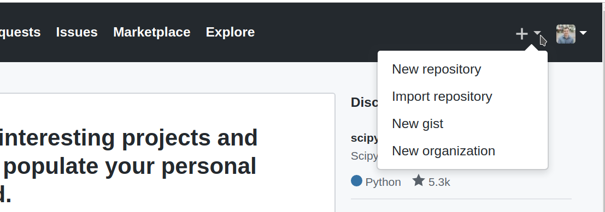
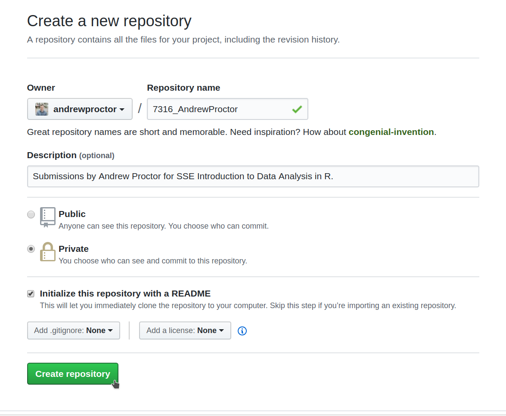

```{r setup, include=FALSE}
knitr::opts_chunk$set(echo = TRUE)
```

If possible, before the first seminar follow the instructions below to set up 
some of the tools we will be working with throughout the course.  If you have any 
difficulty with the setup process, feel free to contact me or ask for assistance 
during the first seminar.

---

1.  **Install R and RStudio:** On your laptop, please install the latest version 
of both R and RStudio.  The links for both can be found 
under the downloads section of the course website. 

2.  **Create a GitHub for Education account**: We will be working with Git and 
GitHub throughout the course (including submitting your work), so you will need 
to create a "GitHub for Education Account" if you don't already have one. 

    + To do so, go to the "GitHub for Education" link on the course website. If you 
    don't have a GitHub account, you will be asked to create one at this 
    stage.
    
    + When creating a GitHub account, consider your username 
    carefully. This should be something that you are confortable using in a 
    professional setting.
    
    + Complete the rest of the GitHub for Education sign-up process by verifying 
    that you are a student.

3. **Create a course repository on GitHub:** Once you've finished setting up your 
Github account, create a private repository, which will be used for submitting 
your work. The instructions for setting this up are as follows:

    + While signed in on GitHub, click on the **+** upper righthand corner of the 
    GitHub page.
    + In the dropdown menu, select **New repository**.
    
    ```{r out.width = "50%", fig.align = "center", echo=FALSE}
    
    ```
    
    + Under **Repository name**, write *7316_FirstandLastName* 
    (mine would be *7316_AndrewProctor*).
    + Under Description, write "Submissions by [YOUR NAME] for SSE Introduction 
    to Data Analysis in R".
    + Change the Repository type to **Private**
    + Click the checkbox for **Initialize this repository with a README**.
    + Finally, click **Create Repository**.
   
   \newpage
  \hspace{1.5cm} {\footnotesize Your repository setup should look like this:}
   \vspace{-0.5em}
```{r out.width = "80%", fig.align = "center", echo=FALSE}
    
```

4.  **Share your course repository**: Once you've created the repository, 
click on the **Settings** link below the repository name and then click on 
**Collaborators**.  From there, add me as a collaborator by putting in my 
GitHub username (andrewproctor) and clicking **Add collaborator**.

    + In the future, upload your course submissions (ie seminar exercises and 
    capstone project) to this repository.
    + For the first seminar exercise, upload your "Statement of Accomplishment."