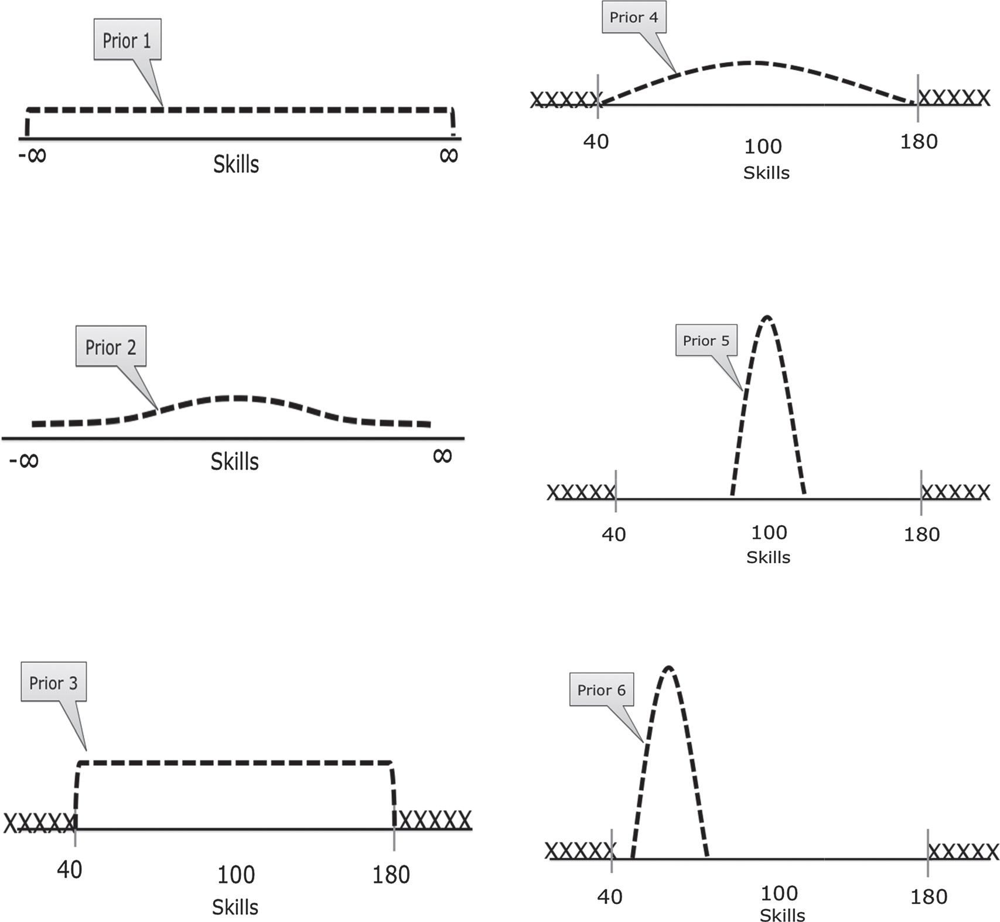
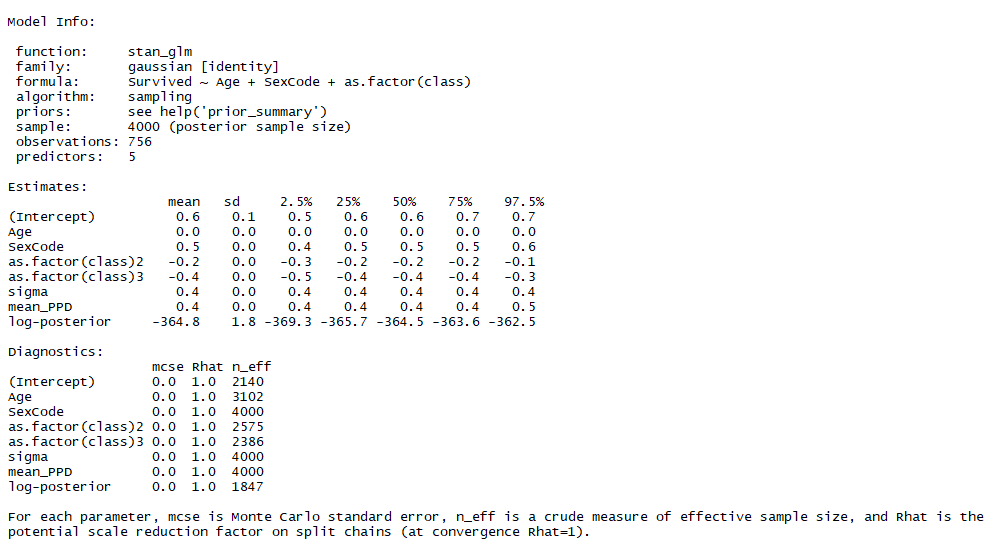
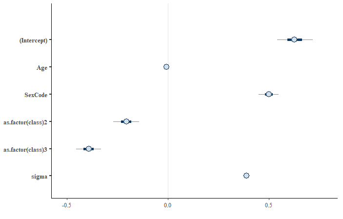

```{r setup, include=FALSE}
knitr::opts_chunk$set(echo = TRUE)
library(rio)
library(tidyverse)
library(rstan)
library(rstanarm)
library(bayesplot)

```

# Conceptual Introduction

## Thought Experiment

### Question

Imagine I'm conducting a raffle.  I have a large bowl, and inside of 
it are many raffle entries, each with different numbers on them.  

- Let the variable *x* represent the number drawn from the bowl.  

- Before reaching into the bowl, I want to know:  


    *''What is the probability that I'm going to pick up a number less than 10 from the bowl?''*

- That is, what is $p(x \leq 10)$?

    + ***Does this probability change if I tell you that all the numbers in the 
    bowl have at least 3 digits (ie are $\geq 100$)?***

## Thought Experiment

### Answer

**Classical Statistics:** No. 

- Probability is defined as:  $\lim_{n \rightarrow \infty} \frac{n_S}{n}$, 
where $n$ is the number of times I repeat the experiment and $n_S$ is the number 
of times a number $x \leq 10$ is drawn.

- $p(x \leq 10)$ was always equal to zero, all that changed was your knowledge of 
the experiment.

**Bayesian Statistics:** Almost certainly. 

-  Probability is a measure of subjective belief about how likely an event is, 
based on prior understanding and new information.
  
  + Prior $\rightarrow$ Information $\rightarrow$ Posterior
    
## Epistomological difference 
- Bayesian statistics integrates the epistemological uncertainty of statistical 
estimation into its core procedures.  It's fundamental goal is to assess and 
improve the accuracy of one's beliefs based on a set of identifying statistical 
assumptions.

- Classical statistics attempts to instead conduct inference on the (unknown) 
underlying reality, based on its own set of identifying assumptions.

***NOT mutually exclusive***

## Bayes Rule

The cornerstone of the Bayesian approach (and the source of its name) is the 
conditional likelihood theorem known as **Bayes' rule**.

In its simplest form, Bayes' Rule states that for two events and A and B (with $P(B) \neq 0$): 
$$ P(A|B) = \frac{P(B|A)P(A)}{P(B)} $$

Or, if A can take on multiple values, we 
have the **extended form**:

$$ p(A_i|B) = \frac{p(B | A_i) P(A_i)}{\sum_j P(B|A_j)P(A_j)} $$

## Bayesian Inference with Bayes' Rule

Adapting Bayes' Rule to the case of a parameter value, $\theta$ and observed data *y*, we have:

$$ p(\theta \mid y) = \frac{f(\theta, y)}{f(y)} =  \frac{f(y\mid\theta)p(\theta)}{ \int f(y \mid \theta) p(\theta) d\theta} \underbrace{\propto}_{\text{proportional to}} f(y|\theta)p(\theta) $$

Adding a bit of terminology:

- $p(\theta)$ is the **prior** distribution: our initial subjective belief about 
the probability distribution of $\theta$.
- $f(y|\theta)$ you may recognize from Maximum Likelihood estimation as: 
    
    + $f(y | \theta) = \prod_{i=1}^n f(y_i |\theta) = \mathcal{L} (\theta)$, the **likelihood function**.
    
- Finally, $p(\theta)|y)$ is our **posterior** (post-experiment) belief \ \ \ 
 about the probability distribution of $\theta$.
 
## Bayesian Inference with Bayes' Rule

$$ \overbrace{p(\theta \mid y)}^{\text{posterior}} = \frac{\overbrace{f(y\mid\theta)}^\text{likelihood} \overbrace{p(\theta)}^\text{prior}}{\underbrace{\int f(y \mid \theta) p(\theta) d\theta}_\text{average likelihood}}  \underbrace{\propto}_{\text{proportional to}} \overbrace{f(y|\theta)}^{likelihood} \overbrace{p(\theta)}^{prior}$$

Hence we have the basic statement:

$$ Posterior \propto Likelihood \times Prior $$

- This is commonly summarized as saying that the posterior \ \ \ \ belief is a compromise 
    between the data and prior belief.

## Priors

Given this *compromise with prior beliefs*, Bayesian analysis is often attacked as 
subjective and a lot of emphasis is placed on the role of prior beliefs.  **But fear 
not!**

- First, as the data sample increases, the data becomes the determining factor 
of the posterior probability.

- Moreover, if desired, we can easily specify priors that have *no effect* on the 
posterior estimates.  

## Types of Priors

Different types of priors include:

- **Uninformative (or "flat") priors**:  Priors that have no impact on 
    posterior values (ie assuming total ignorance about the possible parameter 
    value).
    
    + A classic uninformative prior is the uniform prior, which 
    treats all possible parameter values as equally likely: 
    $p(\theta) = c \text{ } \forall \theta \in \Theta$
    
- **Informative priors**:  Priors where we use prior knowledge to 
    specify a prior with a best-guess of the prior mean and distribution for 
    a parameter value.
    
- **Weakly informative** or **regularizing priors**:  Priors which are deliberately 
less informative than our actual knowledge, affecting estimates less than informative 
priors but at least incorporating *very conservative* information into the \ \ \ production 
of posterior estimates.

## Intuition about priors

Think for instance of inference about possible life expectancy:

- We could specify an uninformative prior that says allows for any possible lifespan
(even living to 1 million years old).

- We could specify some skewed normal distribution that approximates our current 
estimates of the distribution of current lifespans.

- Or we could specify some weaker prior that for instance allows life expectancy 
to be more dispersed and ages to reach, say 150 or 200 years old.

    + Weakly informative priors don't use our best understanding of life expectancy, 
    but at least "tells" our analysis that some possibilities are very implausible.
    
***In almost all circumstances, a weak prior should be preferred.***

## Prior Example: 



## Bayesian Computation

One major feature of Bayesian inference that I haven't mentioned so far is 
the intractability of analytic solutions for estimating posterior distributions
in most circumstances.

Recall:
$$ p(\theta \mid y) = \frac{f(\theta, y)}{f(y)} =  \frac{f(y\mid\theta)p(\theta)}{ \int f(y \mid \theta) p(\theta) d\theta} $$

For models that are more complex or that involve high-dimensional data, closed-form
solutions are not available for the integral in the denominator.

Hence, Bayesian analysis instead typically relies on numerical methods, usually 
Markov Chain Monte Carlo (MCMC) methods.

## MCMC Methods

This method relies on sequentially sampling values of $\theta$ from an approximation 
of the posterior distribution and then correcting the approximation to create 
better subsequent samples.

- Because the approximated distribution used in 1 step relies on the sample 
from the previous step, the simulation forms a **Markov chain**.

- A critical property then is **convergence**:  Have our simulations converged 
to the real target distribution?

    + Typically instead of running one really long "chain", researchers use 
    multiple short chains.  
    + The aggregate can not only converge faster, but 
    can provide a better sense of convergence through the noisiness between
    multiple chains.
    

## Hypothesis Testing in Bayesian Analysis?

Another point of divergence for Bayesian vs. frequentist data analysis is even 
more dramatic:

- Largely, there is no place for null-hypothesis significance testing (NHST) in
Bayesian analysis

    + Bayesian analysis has *something* similar called a **Bayes' factor**, which 
    essentially assigns a prior probability to the likilihood ratio of a null 
    and alternative model and then estimates it's posterior probability.
    
    + But Bayes factors are heavily criticized by leading Bayesians like Andrew 
    Gelman and Donald Rubin, because it is highly sensitive to prior probabilities 
    and model structures, among other issues.
    
- Instead, analysis is oriented around estimation of the posterior distribution 
of parameters (or predictions).

## Bayesian Inference with Credible Intervals

Without NHST to tell us if our results are significant, does that mean we just 
get point estimates and no way to assess how reliable they are? ***No!***

- Recall that we are estimating the posterior *distribution* of a parameter (or 
predicted outcome).

- Hence, we can easily produce a 95% interval for the parameter, simply using 
the quantiles of the posterior CDF.

In Bayesian analysis, we replace the 100($1-\alpha$)% frequentist confidence 
interval with the 100($1-\alpha$)% **credible interval**.

## Bayesian Inference with Credible Intervals

 A credible interval, however, has a much more appealing interpretation than 
a confidence interval.

- A confidence interval has the interpretation that, in repeated samples, 
    the true parameter lies within the confidence region 95% of the time.
    
- A credible interval is what people *think* a confidence interval should mean: 
there is a 95% chance that the true value lies within the 95% credible interval.

# Bayesian Regression with rstanarm

## Stan

Probably the best approach to doing Bayesian analysis in any software environment 
is with [rstan](https://www.rdocumentation.org/packages/rstan), which is 
an R interface to the Stan programming language designed for Bayesian analysis.

- To use [rstan](https://www.rdocumentation.org/packages/rstan), you will first need to 
install **RTools** from [this link](https://github.com/stan-dev/rstan/wiki/Installing-RStan-on-Windows).

- Then install the package [rstan](https://www.rdocumentation.org/packages/rstan) 
from RStudio (make sure to set `dependencies=TRUE` when installing).

## Parallelization support

Once you've setup [rstan](https://www.rdocumentation.org/packages/rstan), there 
is one more thing you should typically do:  tell it to run on multiple cores.

  + rstan includes support for basic parallelization that speeds up execution 
  tremendous for larger / more complex regressions.

```{r, message=FALSE,warning=FALSE}
library(rstan)
rstan_options (auto_write=TRUE)
# Run on multiple cores
options (mc.cores=parallel::detectCores ()) 
```

## A Stan regression example

Now that you're ***hopefully*** excited about rstan, let's look at an example of
a rstan regression from the package documentation:

```{r, eval = FALSE}
# Create schools.stan --------------------------
data {
  int<lower=0> J;       // number of schools 
  real y[J];            // estimated treatment effects
  real<lower=0> sigma[J]; // s.e. of effect estimates 
}
parameters {
  real mu; 
  real<lower=0> tau;
  vector[J] eta;
}

```

## A Stan regression example

```{r, eval = FALSE}
## Still creating schools.stan
transformed parameters {
  vector[J] theta;
  theta = mu + tau * eta;
}

model {
  target += normal_lpdf(eta | 0, 1);
  target += normal_lpdf(y | theta, sigma);
}
# End of schools.stan --------------------------

## Run Stan regression using schools.stan
fit1 <- stan(
  file = "schools.stan", # Stan program
  data = schools_data,    # named list of data
  chains = 4,             # number of Markov chains
  warmup = 1000,          # number of warmup iterations per chain
  iter = 2000,            # total number of iterations per chain
  cores = 2,              # number of cores (using 2 just for the vignette)
  refresh = 1000          # show progress every 'refresh' iterations
  )
```


## Making RStan easy

***Oops!  That was a lot of code!***  And there's still a bit more left out. Luckily, 
there are a couple of packages that exist to make your life easier:

- First, there is [rstanarm](https://www.rdocumentation.org/packages/rstanarm), 
which was created by the developers of Stan and rstan to make running a 
Bayesian regression with rstan much more like you would run a normal frequentist 
regression.

- Another very similar package to rstanarm is 
[brms](https://www.rdocumentation.org/packages/brms), which also makes 
running Bayesian regression much simpler and 'R-like'.

## Short comparison of rstanarm and brms

**rstanarm** is faster, has better posterior checking, and is a bit simpler to 
use.

**brms** is generally a bit more flexible, with support for some regression types 
missing in rstanarm, more flexible specification of priors, and support for 
more types of error correlational structures.

- My sense is that [rstanarm](https://www.rdocumentation.org/packages/rstanarm) is 
the more popular choice, so that's what we'll use here.

## Using rstanarm

With rstanarm, most regressions you run using the function [stan_glm()](https://www.rdocumentation.org/packages/rstanarm/versions/2.17.2/topics/stan_glm) 

- Since generalized linear models (GLMs) incorporates models like linear 
regression, probit, logit, Poisson, binomial, exponential, etc)

**Syntax:**
```{r, eval=FALSE}

mybayesreg <- stan_glm(y ~ X1 + x2 + x3 ..., 
                       family = myfamily, data = mydata, 
                       prior = myprior)
```

## Options with stan_glm

**Family** (with a possible **link** argument needed as well) defines the type of 
regression you want:

- Linear regression:  `family = gaussian`
- Logit: `family = binomial(link = "logit")`
- Probit: `family = binomial(link = "probit")`
- Poisson: `family = poisson`
- More options can be read from the main [GLM page](https://www.rdocumentation.org/packages/stats/versions/3.4.3/topics/glm)

**Prior distributions:**

- **Flat priors** can be set by using `prior = NULL`
- *[Weakly]* Informative Priors can be specified by using `prior = ` with one of: 

    + *normal, student_t, cauchy, laplace* and more found 
    [here](https://www.rdocumentation.org/packages/rstanarm/versions/2.17.2/topics/priors)


## A Titanic survival example with rstanarm

```{r}
titanic <- import("https://raw.githubusercontent.com/vincentarelbundock/Rdatasets/master/csv/datasets/Titanic.csv")
# Display titanic data
glimpse(titanic,width = 50)
```

## A Titanic survival example with rstanarm

```{r, message=FALSE}
# Recode Class
titanic$class  <- recode(titanic$PClass, "*"="NA",
    "1st"="1", "2nd"="2", "3rd"="3")
titanic$class [titanic$class == "NA"] <- NA
titanic$class <- as.numeric(titanic$class)

TitanicLinear <- stan_glm(Survived ~ Age + 
    SexCode + as.factor(class), 
    data = titanic, family = gaussian)

```


## Summary data from stan_glm
```{r, eval=FALSE}
summary(TitanicLinear)
```

\vspace{-1em}
{height=110%}

## Viewing credible intervals

```{r, eval = FALSE}
plot(TitanicLinear)
```

{height=60%}


## Credible intervals

You can also easily get print the credible intervals with the function [posterior_interval()](https://www.rdocumentation.org/packages/rstanarm/versions/2.17.2/topics/posterior_interval.stanreg) 

```{r}
posterior_interval(TitanicLinear, prob=0.95)
```

## Plotting the posterior distribution

You can also easily plot the posterior distribution of a parameter in R.

```{r, eval=FALSE}
Titanic_posterior <- TitanicLinear %>% as.tibble() %>% 
  rename(sec.class = "as.factor(class)2",
         third.class = "as.factor(class)3")

ggplot(Titanic_posterior, aes(x=third.class)) + 
  geom_histogram()

```

## Plotting the posterior distribution

```{r, echo=FALSE, message=FALSE}

Titanic_posterior <- TitanicLinear %>% as.tibble() %>% 
  rename(sec.class = "as.factor(class)2",
         third.class = "as.factor(class)3")

ggplot(Titanic_posterior, aes(x=third.class)) + 
  geom_histogram()

```

## Juxtaposing the prior and the posterior

```{r, echo=FALSE}
posterior_vs_prior(TitanicLinear)
```


# Model Testing

## Model testing basics

There are a number of different regression diagnostics after performing Bayesian 
regression to help infer if the model converged, how well it performs, and 
even compare between models.

Today, we'll cover some of them included with rstanarm as well as the very useful 
[shinystan package](https://www.rdocumentation.org/packages/shinystan).


## Graphical posterior predictive analysis 

To check the predictive accuracy of the posterior distribution, you can use the 
function [pp_check()](https://www.rdocumentation.org/packages/rstanarm/versions/2.17.2/topics/pp_check.stanreg), 
which plots simulated y values from the posterior distribution against the 
actual values of y.

```{r, eval=FALSE}
pp_check(TitanicLinear)
```

## Graphical posterior predictive analysis 

```{r, echo=FALSE}
pp_check(TitanicLinear)
```


## Regularization and Predictive Accuracy

A critical issue in both Bayesian and frequentist estimation is how to balance 
predictive accuracy with parsimony.  Put another, the researcher should be 
concerned with not overfitting the data while still creating a compelling model.

The basic approach in frequentist method is to use the Akaike information criterion 
(AIC):

**Expected Log Predictive Density:**   $$\hat{elpd}_{AIC}  =  \log p(y | \hat{\theta}_{MLE}) - k$$

- Where $\theta_{MLE}$ is the maximum likelihood estimator of $\theta$,
- $\log p(y | \hat{\theta}_{MLE})$ is the log likelihood given $\theta_{MLE}$,
- and k is the number of parameters in the model.

The most basic Bayesian adaptation of the AIC is the Deviance information criterion (DIC):

$$\hat{elpd}_{DIC}  =  \log p(y | \hat{\theta}_{Bayes}) - p_{DIC}$$
- Where $\theta_{Bayes}$ is the mean posterior estimate and
- $p_{DIC}$ is the number of "effective parameters in the model" using a data-biased correction


## Watanabe-Akaike information criterion

An improvement over the DIC is the Watanabe-Akaike information criterion:


$$\hat{elpd}_{WAIC} = \sum_{i=1}^{n} \log p(y_i) - \sum_{i=1}^{n} \log V \Big[p(y_i) \Big]$$

The WAIC has the advantages of:
- Averaging the likelihood over the posterior distribution rather than using the mean
- Does not assume a multivariate Gaussian posterior distribution, as does the DIC (and AIC)

## WAIC example

```{r, message=FALSE}
loo(TitanicLinear)
```


## Leave One Out Cross Validation

Another method alongside WAIC for comparing out-of-sample predictive ability is to apply 
leave-one-out cross-validation (LOO), which assesses predictive ability 
posterior simulations in which the data is iteratively partitioned in training 
and prediction sets.

**Expected Log Predictive Density:**  
$$\hat{elpd}_{LOO} = \sum_{i=1}^{n} \log p(y_i | y_{-i})$$

## LOO example

```{r, message=FALSE}
loo(TitanicLinear)
```

## Comparing models

```{r}
Titanic_probit <- stan_glm(Survived ~ Age + 
    SexCode + as.factor(class), 
    data = titanic, family = binomial(link=probit))
Loo_probit <- loo(Titanic_probit)

Titanic_logit <- stan_glm(Survived ~ Age + 
    SexCode + as.factor(class), 
    data = titanic, family = binomial(link=logit))
Loo_logit <- loo(Titanic_logit)

compare_models(Loo_probit, Loo_logit)
# ELPD_diff>0 indicates more support for 2nd model
```


## Many more diagnostics with shinystan

Probably the most popular diagnostic for Bayesian regression in R is the 
functionality from the [shinystan package](https://www.rdocumentation.org/packages/shinystan).

- Shinystan launches a "Shiny" web application to show you model diagnostics, so 
it can't be done inside of a RMarkdown document (but works just fine if called 
from the console.)

```{r, eval=FALSE}
# Don't do in RMarkdown
launch_shinystan(TitanicLinear)

```
