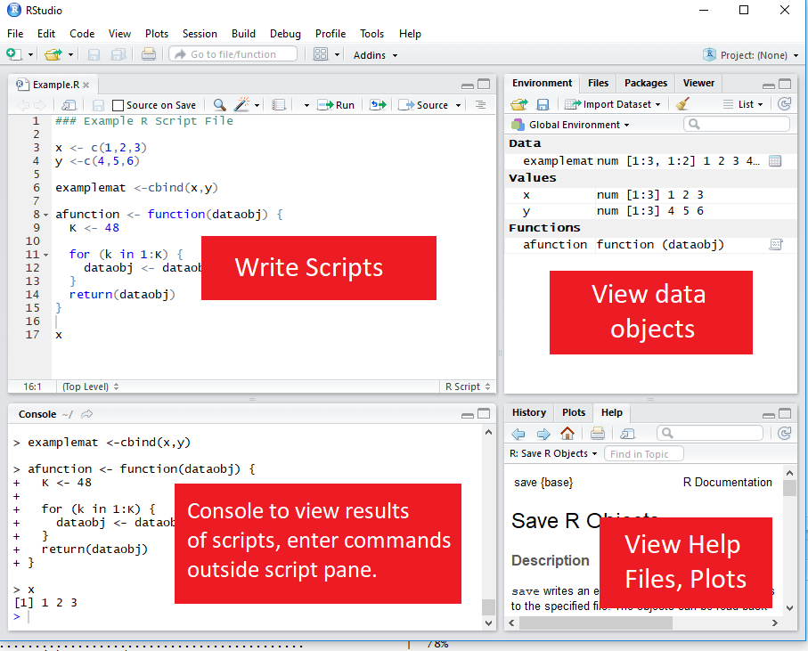

```{r setup, include=FALSE}


```

<a class="btn btn-primary" href="https://andrewproctor.github.io/rminicourse/assets/module1-baseR.pdf" role="button">Slides</a>
<a class="btn btn-primary" href="https://www.datacamp.com/courses/6356" role="button">DataCamp Exercises</a>

<br>

# Intro

## Learning Outcomes

How to:

1. Import and transform using standard R functions

2. Extend R functionality through packages and user-written programming

3. Create compelling presentations for data analysis projects

4. Peform basic econometric analysis in R

5. Understanding and perform basic Bayesian analysis in R

## Format

Seven modules:

- Five introducing new topics, with the first ~ 30-45 minutes going
over material and the remainder of the time working on exercises.

- One capstone module that brings together everything covered in the first 5
lessons.

- A brief Bayesian methods course at the end.

No homework etc - goal is for everything to be doable in the seminars.

Course content and helpful resources on the course website:


# R & Statistical Programming 

## Purpose of statistical programming software

Unlike spreadsheet applications (like Excel) or point-and-click statistical 
analysis software  (SPSS), statistical programming software is based around a 
script-file where the user writes a series of commands to be performed,

**Advantages of statistical programming software**

- Data analysis process is reproducible and transparent.

- Due to the open-ended nature of language-based programming, there is far more 
versatility and customizability in what you can do with data.

- *Typically* statistical programming software has a much more comprehensive 
range of built-in analysis functions than spreadsheets etc.

## Characteristics of R

* R is an open-source language specifically designed for statistical computing
(and it's the most popular choice among statisticians)

* Because of its popularity and open-source nature, the R community's 
package development means it has the most prewritten functionality of any data 
analysis software.

* Differs from software like Stata, however, in that while you can use 
prewritten functions, it is equally adept at programming solutions for yourself.

* Because it's usage is broader, R also has a steeper learning curve than Stata.


## Comparison to other statistical programming software

* **Stata**: The traditional choice of (academic) economists.  
    +  Stata is more specifically econometrics focused and is much more 
    command-oriented.  Easier to use for standard applications, but if there's 
    not a Stata command for what you want to do, it's harder to write something yourself.  
    +  Stata is also very different than R in that you can only ever work with one 
    dataset at a time, while in R, it's typical to have a number of data objects 
    in the environment.

* **SAS**:  Similar to Stata, but more commonly  used in business & the private 
sector, in part because it's typically more convenient for massive datasets.  Otherwise, 
I think it's seen as a bit older and less user-friendly.

* **Python**: Another option based more on programming from scratch and with 
less prewritten commands.  Python isn't specific to math \& statistics, but 
instead is a general programming language used across a range of fields.  
Probably the most similar software choice to R at this point, with better 
general use (and programming ease) at the cost of less package development 
specific to econometrics/data analysis.

* **Matlab**: Popular in macroeconomics and theory work, not so much in 
empirical work. Matlab is powerful, but is much more based on programming "from 
scratch" using matrices and mathematical expressions.

## Useful resources for learning R

- **DataCamp:**  interactive online lessons in R. 
    + Some of the courses are free (particularly community-written lessons like 
    the one you'll do today), but for paid courses, DataCamp costs about 300 SEK / mo.

- **RStudio Cheat Sheets:** Very helpful 1-2 page overviews of common tasks 
and packages in R.

- **Quick-R:**  Website with short example-driven overviews of R functionality.

- **StackOverflow:**  Part of the Stack Exchange network, StackOverflow is a 
Q&A community website for people who work in programming.  Tons of incredibly
good R users and developers interact on StackExchange, so it's a great place to
search for answers to your questions.


- **R-Bloggers:**  Blog aggregagator for posts about R.  Great place to learn 
really cool things you can do in R.

- **R for Data Science:**  Online version of the book by Hadley Wickham, who has
written many of the best packages for R, including the Tidyverse, which we will 
cover.

# Getting Started in R

## RStudio GUI

RStudio is an is an integrated development environment (IDE).  

This means that in addition to a script editor, it also let's you view your 
environments, data objects, plots, help files, etc directly within the application.




## Executing code from the script 

To execute a section of code, highlight the code and click "Run" or use 
Ctrl-Enter. 

- For a single line of code, you don't need to highlight, just click 
into that line.

- To execute the whole document, the hotkey is Ctrl-Shift-Enter.

## Style advise

Unlike Stata, with R you don't need any special code to write multiline code - 
it's already the default (functions are written with parentheses, so its clear
when the line actually ends.)

- So there's no excuse for really long lines.  Accepted style suggests using a 
80-character limit for your lines.

- RStudio has the option to show a guideline for margins.  **Use it!**
    + Go to **Tools -> Global Options -> Code -> Display**, then select
    **Show Margin** and enter 80 characters.
    
You can also write multiple expressions on the same line by using 
<span style="color:blue">;</span>  as a manual line break.

## Help files in R

You can access the help file for any given function using the **help function.** 
You can call it a few different ways:

1.  In the console, use <span style="color:blue"> **help()**</span>
2.  In the console, use <span style="color:blue"> **?**</span> 
immediately followed by the name of the function (no space inbetween)
3.  In the Help pane, search for the function in question.

<span style="color:blue"> **?**</span> is shorter, so that's the most frequent method.  

```{r help, eval=FALSE}
# Help on the lm (linear regression) function
?lm
```


## Setting the working directory

To set the working directory, use the function  <span style="color:blue"> **setwd()**</span>. 
The argument for the function is simply the path to the working directory, in 
quotes.

However:  be sure that the slashes in the path are backslashes 
($\backslash$). For Windows, this is not the case if you copy the 
path from File Explorer. 

```{r wd, eval=FALSE}
# Set Working Directory
setwd("C:/Users/AN.4271/OneDrive - 
      Handelshögskolan i Stockholm/MyProject")
```


## Comments

To create a comment in R, use a hash (<span style="color:blue"> **#**</span>.  For example:

```{r comments}
# Here I add 2 + 2
2 + 2
```


# Data Types & Operations

## Math operations in R
Examples of basic mathematical operations in R:
```{r math1}
# Addition and Subtraction
2 + 2
# Multiplication and Division
2*2 + 2/2
# Exponentiation and Logarithms
2^2 + log(2)
```

## Logical operations in R

You can also evaluate logical expressions in R

```{r logical}
## Less than
5 <= 6
## Greater than or equal to
5 >= 6
## Equality
5 == 6
## Negatiion
5 != 6
```

You can also use AND (<span style="color:blue"> **&**</span>) and OR 
(<span style="color:blue"> **|**</span>) operation with logical expressions:
```{r logical2}
## Is 5 equal to 5 OR 5 is equal to 6
(5 == 5) | (5 == 6)
## 5 less 6 AND 6 < 5
(5 < 6) & (7 < 6)
```


## Defining an object

To define an object, use <span style="color:blue">**<-**</span>.  For example


```{r define}
# Assign 2 + 2 to the variable x
x <- 2 + 2
```

**Note:** In R, there is no distinction between defining and redefining an 
object (*a la* gen/replace in Stata). 
```{r define2}
y <- 4 # Define y
y <- y^2 # Redefine y
y #Print y 
```

## Data classes
Data elements in R are categorized into a few seperate classes (ie types)

- **numeric**:  Data that should be interpreted as a number.

- **logical:** Data that should be interpreted as a logical statment, ie. 
`r TRUE` or `r FALSE`.

-  **character**:  Strings/text.
    + Note, depending on how you format your data, elements that may look 
      like logical or numeric may instead be character.
- **factor**: In affect, a categorical variable.  Value may be text, but R 
interprets the variable as taking on one of limited number of possible values 
(e.g. sex, municipality, industry etc) 

## What's the object class?
```{r test}
a <- 2; class(a)
b <- "2"; class(b)
c <- TRUE; class(c)
d <- "True"; class(d)

```    

# Vectors & Matrices


## Vectors

The basic data structure containing multiple elements in R is the vector. 

- An R vector is much like the typical view of a vector in mathematics, ie it's 
basically a 1D array of elements.

- Typical vectors are of a single-type (these are called atomic vectors).

- A *list* vector can also have elements of different types.

## Creating vectors

To create a vector, use the function <span style="color:blue">**c()**</span>.  

```{r days}
# Create `days` vectors
days <- c("Mon","Tues","Wed",
           "Thurs", "Fri")

# Create `temps` vectors
temps <- c(13,18,17,20,21)
# Display `temps` vector
temps
```

## Naming vectors
You can name a vector by assigning a vector of names to <span style="color:blue">**c()**</span>, 
where the vector to be named goes in the parentheses. 
```{r namedays}
# Assign `days` as names for `temps` vector
names(temps) <- days 
# Display `temps` vector
temps
```

## Subsetting vectors
There are multiple ways of subsetting data in R.  One of the easiest methods for 
vectors is to put the subset condition in brackets:
```{r subsettemp}
# Subset temps greater than or equal to 10
temps[temps>=18]

```

## Operations on vectors
Operations on vectors are element-wise.  So if 2 vectors are added together, 
each element of the $2^{nd}$ vector would be added to the corresponding element 
from the $1^{st}$ vector.
```{r averagevector}
# Temp vector for week 2
temps2 <- c(8,10,10,15,16)
names(temps2) <- days
# Create average temperature by day
avg_temp <- (temps + temps2) / 2
# Display `avg_temp`
avg_temp

```

## Matrices
- Data in a 2-dimensional structure can be represented in two formats, as a 
*matrix* or as a *data frame.* 

- A matrix is used for 2D data structures of a single data type (like atomic 
vectors). 
    + Usually, matrices are composed of numeric objects.

- To create a matrix, use the <span style="color:blue">**matrix()**</span> command. 

The syntax of <span style="color:blue">** matrix() **</span> is:
```{r matrixsynatx, eval=FALSE}
matrix(x, nrow=a, ncol=b, byrow=FALSE/TRUE)
```
-*x* is the data that will populate the matrix.

-*nrow* and *ncol* specify the number of rows and columns, respectively.  
Generally need to specify just 1 since the number of elements and a single 
condition will determine the other.

-*byrow* specifies whether to fill in the elements by row or column. The
default is <span style="color:blue">**byrow=FALSE**</span>, ie the data is filled in by 
column.


## Creating a matrix from scratch

A simple example of creating a matrix would be:
```{r matrix1thru6a}
matrix(1:6, nrow=2, ncol=3, byrow=FALSE)
```
Note the difference in appearance if we instead **byrow=TRUE**
```{r matrix1thru6b}
matrix(1:6, nrow=2, ncol=3, byrow=TRUE)
```

Using the same <span style="color:blue">**c()**</span> function as in the creation of a vector, we can specify 
the values of a matrix:

```{r matrixc}
matrix(c(13,18,17,20,21,
         8,10,10,15,16), 
         nrow=2, byrow=TRUE)
```
- Note that the line breaks in the code are purely for   
readability purposes.  Unlike Stata, R allows you to break  
code over multiple lines without any extra line break syntax. 

## Creating a matrix from vectors

Instead of entering in the matrix data yourself, you may want to make a matrix 
from existing data vectors:
```{r matrixfromvec}
# Create temps matrix
temps.matrix <- matrix(c(temps,temps2), nrow=2, 
                        ncol=5, byrow=TRUE)
# Display matrix
temps.matrix
```
 
## Naming rows and columns
-Naming rows and columns of a matrix is pretty similar to naming  vectors.

-Only here, instead of using <span style="color:blue">**names()**</span>, we use
<span style="color:blue">**rownames()**</span> and <span style="color:blue">**colnames()**</span>
 
```{r matrixnames}
# Create temps matrix
rownames(temps.matrix) <- c("Week1", "week2")
colnames(temps.matrix) <- days
# Display matrix
temps.matrix
```

## Matrix operations

In R, matrix multiplication is denoted by <span style="color:blue">**%*%**</span>, as in 
<span style="color:blue">** A %*% B **</span>

<span style="color:blue">**A * B**</span> instead performs *element-wise* (Hadamard) multiplication 
of matrices, so that <span style="color:blue">**A * B**</span> has the entries $a_1 b_1$, $a_2 b_2$ etc.

- An important thing to be aware of with R's <span style="color:blue">**A * B**</span> notation, 
however, is that if either of the terms is a 2D vector, the terms of this 
vector will be distributed elementwise to each colomn of the matrix.

## Elementwise operations with a vector and Matrix

```{r, include=FALSE}
vecA <- c(1,2)
matB <-matrix(1:6, nrow=2, byrow=TRUE)
```

```{r}
vecA; matB
vecA * matB
```

# Data Frames

## Creating a data frame

- Most of the time you'll probably be working with datasets that are recognized as
data frames when imported into R.

- But you can also easily create your own data frames.

- This might be as simple as converting a matrix to a data frame:

```{r}
mydf <- as.data.frame(matB)
mydf
```

- Another way of creating a data frame is to combine other vectors or matrices (of
the same length) together.

```{r}
mydf <- data.frame(vecA,matB)
mydf
```

## Defining a column of a data frame (or other 2D object):

Once you have a multidimensional data object, you will usually want to create or
manipulate particular columns of the object. 

The default way of invoking a named
column in R is by appending a dollar sign and the column name to the data object.

## Example of adding a new column to a data frame
```{r, include=FALSE}
library(Ecdat)
library(tidyverse)
data(Males)
set.seed(28133)
wages <- Wages1 %>% as.tibble() %>% sample_n(3) %>% as.data.frame() %>% select(wage,school, sex, exper) %>% rename(schooling = school) %>% mutate(wage=exp(wage))

# Source: Verbeek, Marno (2004) A Guide to Modern Econometrics, John Wiley and Sons.
```

```{r}
wages # View wages data frame
wages$expersq <- wages$exper^2; wages  # Add expersq
```

## Viewing the structure of a data frame

Like viewing the class of a homogenous data object, it's often helpful to view
the structure of data frames (or other 2D objects).  

- You can easily do this using the <span style="color:blue">** str() **</span> function.

```{r}
# View the structure of the wages data frame
str(wages)
```

## Changing the structure of a data frame:

A common task is to redefine the classes of columns in a data frame.

- Common commands can help you with this when the data is formatted suitably:
 
    + <span style="color:blue">**as.numeric()**</span> will take data that “looks like numbers” but 
    are formatted as characters/factors and change their formatting to numeric.
    
    + <span style="color:blue">**as.character()**</span> will take data formatted as numbers/factors 
    and change their class to character.
    
    + <span style="color:blue">**as.factor()**</span> will reformat data as factors, taking by 
    default the unique values of each column as the possible factor levels.

## More about factors

Although <span style="color:blue">**as.factor()**</span> will suggest factors 
from the data, you may want more control over how factors are specified.

With the <span style="color:blue">**factor()**</span>  function, you supply 
the possible values of the factor and you can also specify ordering of factor 
values if your data is ordinal.

## Example of creating ordered factors
A dataset  on number of extramarital affairs from Fair (Econometrica 1977) has 
the following variables:  number of affairs, years married,
presence of children, and a self-rated (Likert scale) 1-5 measure of marital
happiness.

```{r, include = FALSE}

data(Fair)
set.seed(321789)
affairs <- Fair %>% as.tibble() %>% sample_n(3) %>% as.data.frame() %>% select(nbaffairs, ym, child, rate) %>% rename(affairs = nbaffairs, yrsmarr= ym, mrating = rate) 

# Source:  Fair, R. (1977) “A note on the computation of the tobit estimator”, Econometrica, 45, 1723-1727. 
```

```{r}
str(affairs) # view structure

## Format mrating as ordered factor
affairs$mrating <-factor(affairs$mrating, 
   levels=c(1,2,3,4,5), ordered=TRUE)
str(affairs)
```

Note that the marital rating (*mrating*) initially was stored as an integer,
which is incorrect.  Using factors preserves the ordering while
not asserting a numerical relationship between values.

## Selections and subsets in data frames

Similar to subsetting a vector, matrices & data frames can also be subsetted for 
both rows and columns by placing the selection arguments in brackets after the 
name of the data object:

\begin{center} dataframe[\textit{RowArgs},\textit{ColArgs}] \end{center}


Arguments can be: 

- Row or column numbers (eg mydf[1,3])

- Row or column names

- Rows (ie observations) that meet a given condition

## Example of subsetting a data frame

```{r}
# Subset of wages df with schooling > 10, exper > 10
wages[(wages$schooling > 10) & (wages$exper > 10),]
```

**Notice** that the column argument was left empty, so all columns are returned 
by default.
