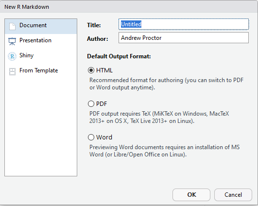
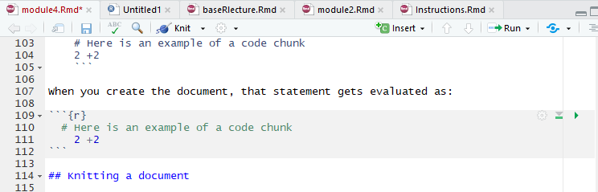
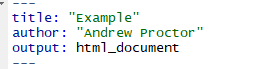
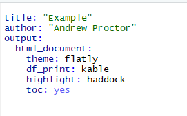
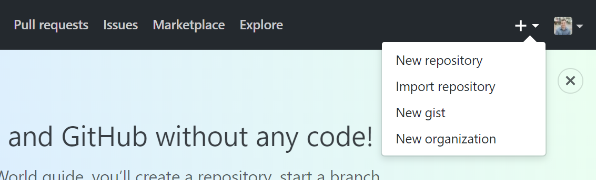
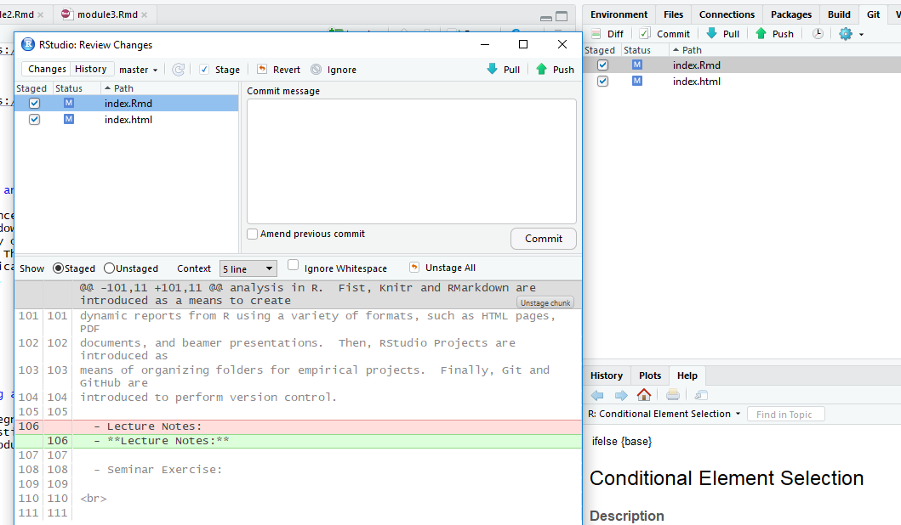

```{r setup, include=FALSE}
library(tidyverse)
library("rio")
```

<br>
<br>


### Goals for Module

- Learn how to create dynamic R documents in a variety of formats using knitr 
and RMarkdown

- Learn how to how manage the project structure using RSTudio projects.

- Learn how to perform local and online online version control using Git and
 GitHub.

<br>
<br>


## RMarkdown documents

### Reproducible R Reports

- So far, we have been working purely with basic "R Script" files, which are 
very simliar to Stata do-files.

- But thanks largely to the [knitr package](https://yihui.name/knitr/), you can 
easily create reports that interweaves text and R code in a neatly structured 
manner.

- Output can be structured as PDF documents, HTML webpages, Word documents, or 
various presentation formats including Beamer (LaTex) presentations.

  + The course website, lecture slides, and exercise instructions have all been
    generated in R.
    
<br>


### Getting started

- Reports of different file formats are generated using the 
[knitr package](https://yihui.name/knitr/). 

- Before installing knitr, make sure sure that you have a Latex distribution 
installed.

- Then install the knitr package and initialize it in the usual manner.

```{r}
# Run only once (ie in the console)
    # install.packages("knitr") 

# Initialize library
library("knitr")
```

<br>

### Knitr and RMarkdown

Knitr allows for the creation of documents structured using two different 
typesetting languages: 

- LaTex with the .RNW file

- Markdown (specifically *RMarkdown*), which was originally created as a simple 
language for structuring HTML markup.

For this course, we will focus on the **RMarkdown** format, which has become the 
dominant method for "knitting" document because of it's lightweight and flexibility.  

- More information about how to generate R reports using the Latex format can be 
found at [https://rpubs.com/YaRrr/SweaveIntro](https://rpubs.com/YaRrr/SweaveIntro).

<br>

### Creating an RMarkdown document

- After installing knitr, to create an RMarkdown document, go to 
**File---New File---R Markdown**.  

- A popup shows up to ask enter the document Title and Author, as well as what 
type of document you want to create.

  
<br>


### Writing and Code in RMarkdown

In RMarkdown, expository writing and code "chunks" are differentiated in writing 
code in specific code chunks.

    ```{r}`r ''`
    # Here is an example of a code chunk
    2 +2 
    ```

When you create the document, that statement gets evaluated as:

```{r}
  # Here is an example of a code chunk
    2 +2 
```

<br>

### Inline Chunks 

You can also include inline code by using initializing with a backtick and the 
letter r (no space between), writing the code, then closing the chunk with another 
backtick.

```{r, include=FALSE}
rinline <- function(code){
  html <- '<code  class="r">``` `r CODE` ```</code>'
  sub("CODE", code, html)
}
```

- For example: `r rinline("2+2")`

<br>


### Knitting a document

To generate a document in the desired output format from a RMarkdown document, 
you need to **"Knit"** the document, which appears as a clickable icon on the menu
atop the script pane.

You do not need to Knit a document after every change, however.  You can just as 
easily run the code chunks.  There are specific specific buttons to run either 
the current chunk or all of the chunks above a given chunk.


<br>


### Writing outside of code chunks

Anything not written inside of these bacticked sections is interpret as normal 
writing.

RMarkdown makes styling your writing particlarly easy.  Some common formatting 
options include:

- **Headers:** Headers are defined using hashes (#)
    - A single # indicates a top level heading (and bigger font), while each 
    additional hash indicates a smaller heading size 
      + So while # is the largest heading size, #### is a small heading
- **Bold**:  To bold text, wrap it in two asterisks:  `**Bold Statement**`
- **Italics:** To italicize text, wrap in a single asterisk: \ \ \ \ \ \ 
`*Italics Statement*`

<br>


### Lists and Latex Input

- **Lists/Bullet Points**: Like the bullet points here, you will often want to 
structure output using lists.  To do so, start each bulleted line with a dash (-). 

    + Make sure to leave an empty line between the start of the list and any other 
    text.
  
    + To make an indent "sub-list", start the sub-list with a plus sign (+) and use 
    tab to indent the line twice for each of the sub-list items.

- **Latex input:** Most LaTex commands (except for generally longer multiline 
structures) can be included in RMarkdown documents just as you'd write them 
in Tex document.

<br>


### Seperating Lines in RMarkdown

- Something you might wonder is how to obey the RStudio 80-character margins while 
allowing your text to wrap normally in the generated documents.

- The answer lies in how new lines are treated in RMarkdown documents.  

    + If the line ends with one space or less, a new line in RMarkdown will not 
    be treated as a new line in the documents generated.
    
<br>

### Code chunk options

There are several output options you can specify for how R code and the code output
are expressed in reports.  These options are expressed as options in the {r} 
declaration at the top of the chunk.

- **echo=FALSE**: do not show the R code itself (but potentially the code output 
depending on other chunk options).

- **include=FALSE**:  do not show the R code or the output in the document.

- **eval=FALSE:** do not actually execute the code inside the chunk, only display 
it.

- **results=hide**:  run the code but do not show the results output.

- **warning=FALSE** / **message=FALSE**:  do not show \ \ \ warnings or messages 
associated with the R code.

<br>


### Output options

When a RMarkdown document is generated in a given output format, there are several 
common things you can do to customize the appearance of the document.

To add options to your document, indent the name of the output type to an indented 
new line and a colon to it.  Then indent under the output type and add the 
desired options.






<br>


### Common output options

Here are a few common options:

- **table of contents**:  to include a table of contents in your document, use 
the <span style="color:blue">**toc: yes**</span> option.

- To change the way data frame output is printed, use the <span style="color:blue">**df_print**</span>
 option.  Good options are <span style="color:blue">**kable**</span> 
or <span style="color:blue">**tibble**</span>.

- To add code highlighting for R chunks, use the 
 <span style="color:blue">**highlight:**</span> option.  

    + **Options include:** default, tango,  pygments, kate, monochrome, espresso, 
    zenburn, haddock, and textmate.
    
- You can also specify output themes for html documents and beamer presentations. 
For html documents, possible themes are listed [here](https://rmarkdown.rstudio.com/html_document_format.html#appearance_and_style) 
while beamer themes are typically supplied \ \ \ \ \ \ by .sty files in your project folder.

<br>
    
### Working Directories in RMarkdown    

In RMarkdown documents, the working directory is automatically set to the folder 
in which the RMarkdown document is saved.

- From there, you can use *relative file paths*.  If data etc is in the root of the 
project folder, then just refer to the file name directly.

- If data is in a subfolder, eg *data*, use a relative path like: 

```{r, eval=FALSE}
import(./assets/mydata.rds)
```

<br>

### R Notebooks

Aside from the standard RMarkdown documents that we've coverd so far, another 
format worth mentioning is the **R Notebook** format.  

- R Notebooks essentially adapt html RMarkdown documents to be even more similar 
to something like Juptyer Notebooks.

- With R Notebooks, you can ***Preview*** documents without knitting them over 
again.  

- The document also generally has the Notebook-style code-output-code layout.

<br>

<br>


## RStudio Projects

### Projects Intro

In addition to using RMarkdown documents to make your scripts and reports more 
compelling, another process upgrade is using **RStudio Projects**.

Projects are useful because they:

- Define a project root folder
- Save a RStudio environment that is unique to each project
- Allow for easy version control

<br>


### Working folder benefits of a Project

- A project root folder is not only preferable to the need to use **setwd()**, but 
also to the default working directory used in RMarkdown documents outside of 
R Projects.  Why?

- Because for substantial research projects, you likely will have a lot of files 
that you split into different subfolders, one of which is probably something like 
***code***. 

    + In this case, you'd need to use somewhat convoluted relative file 
    paths to indicate that the paths should be from the parent folder 
    of ***code***.
    
    <br>


### Using RStudio Projects

To create a RStudio Project, go to **File -- New Project**.  From there, you can 
choose whether to create a new directory, use an existing directory, or use 
a Version Control repository.

- In practice, I'd suggest you use either a **New Directory** or **Version Control** 
depending on whether or not you want to sync your scripts to GitHub.

    + We'll go over version control shortly.
    
Once you have created a Project, you can either open it from the File Menu or by 
opening the .RProj file in the project directory \ \ \ \ root.

<br>
    
### Project workflow structure

**Sample Folder Structure:**


- analysis/
- cache
- citation/
- code/

\vspace{1.5em}

- data/
    + raw_data/
    + derived_data/
- figures/
- images/


**Some workflow management packages:**

- [rrtools](https://github.com/benmarwick/rrtools)
- [workflowr](https://jdblischak.github.io/workflowr/index.html)
- [ProjectTemplate](http://projecttemplate.net/)
- [represtools](http://pirategrunt.com/represtools/)

<br>
<br>

## Version Control

### What is version control?

Version control is a means to track changes made to files

Version control allows you to:

- See a history of every change made to files
-Annotate changes
-Allow you to revert files to previous versions

<br>

### Local Version Control with Git

The most popular software for managing version control is Git.

- There's a good chance you've at least seen GitHub before, which is an online 
remote location for storing version control repositories.

- The Git software, however, is equally adept at managing version control on 
your local computer.

Once Git is installed (and recognized in RStudio), you can use Projects to 
peform local version control.

In **File -- New Project -- New Directory**, once you have Git installed there 
is a checkbox that can be selected to enable to "Create a Git repository".  

- A  repository is a location that Git uses to track the changes of a file or 
folder, here the project folder. The Git repository is stored as a folder named 
".git" in the project root.

- Creating a Project in this manner with a Git repository will enable version 
control on your local computer.

<br>

### Remote version control with GitHub

- In addition to local version control, you can also back up the history of file 
changes to online repositories using GitHub.

- GitHub connects to the local Git repository on your computer, "pushing" and 
"pulling" changes between the local and remote repositories.

- This also allows for easy collaboration on coding projects, as multiple person 
can sync to files by connecting to the remote repository.

<br>

### Using GitHub for remote version control

With a GitHub account, you can create a new online repository by clicking the "+" 
icon in the top right of a GitHub page, and then clicking "New Repository".

  

<br>


### Setting up a new repository
From there, you need to:

- Supply GitHub with a repository name (think folder name)

- Choose whether or not the repository should be public or private (ie whether or 
not you want other people to be able to visit your GitHub page and view the 
repository).
  
    + If you have a GitHub education account, then Private repositories are free. 
    Otherwiwse, you'd need a paid GitHub subscription.
    
- Click on the checkbox to enable "Initialize this repository with a README".

    + Each repository is required to have a readme file, which you may want to 
    comment but is not strictly necessary.  Commenting uses Markdown, which 
    is essentially the same as RMarkdown!

<br>

### Using a Remote Repository with GitHub

Once you've created an online repository, ***Projects*** once again alows you 
to easily connect RStudio with the repository.

- To setup a project for use with GitHub, creat a **New Project** and select 
**Version Control** instead of **New Directory.**

  + From there, simply choose "Git" and then copy the url of the repository from 
  GitHub into RStudio.
  
<br>
  
### Tracking changes with Git

Once you have a Project setup with version control, the first key component of 
tracking changes is "Committing" them to the repository

- A "commit" is an update that saves revisions of files into the Git repository.

You can commit changes by going to the "Git" tab in the upper right-hand side 
of the RStudio IDE. 

- In the Git tab, any files that have changed since the last commit are listed. 
From there, click on the files you'd like to commit and click on the commit button.

- A Commit box appears which shows you the changes since \ \ \ the last 
revision and asks for a commit message, where you should very briefly describe the 
changes.


  

<br>

### Syncing changes with a remote repository

- If you are just tracking changes with a local repository, commit is sufficient 
to manage version control.

- But if you are using version control with an remote (ie online) repository, you will
two other steps to make sure changes are sync between the local repository and 
online.

    + To send changes made locally to the online repository, after comitting changes 
    click on "Push."
    
    + To sync changes from the online repository to local files, click on "Pull".

<br>
    
### Viewing previous commits

- To view previous versions of the files (along with annotations supplied with the 
commit message), click on the clock icon in the Git pane.

- From there, you can see not only a "difference" view of the file changes, but 
you can also open the document exactly how it was written in a previous commit.

- From there, if you wanted to revert changes, you *could* explicitly revert the file 
with Git, or simply copy over the file with code from the previous commit --- my 
preferred method of reverting changes.
